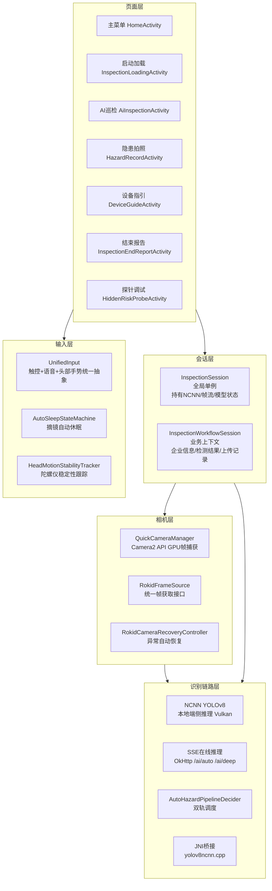
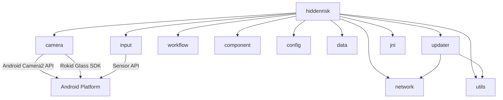
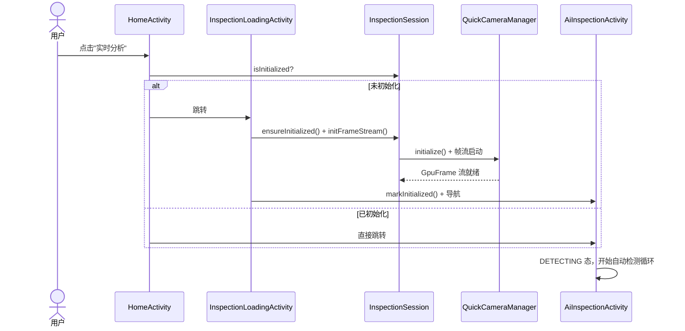
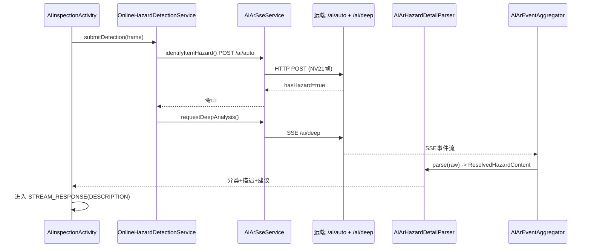
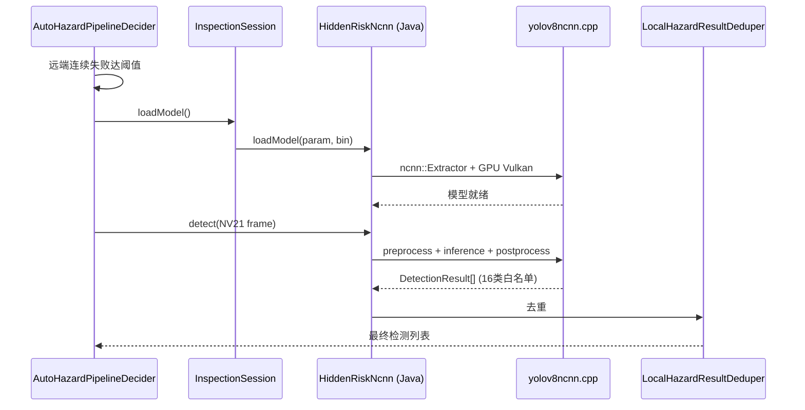
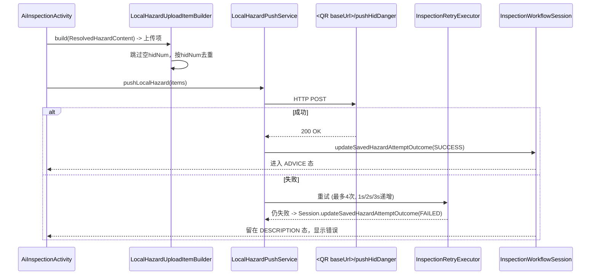
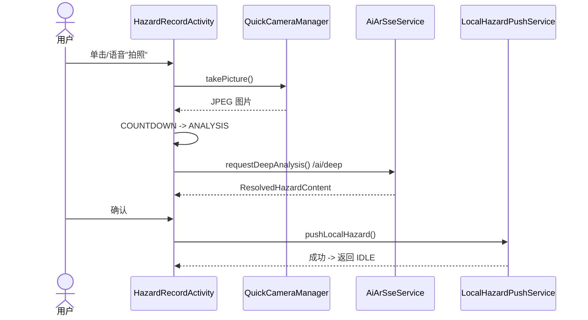
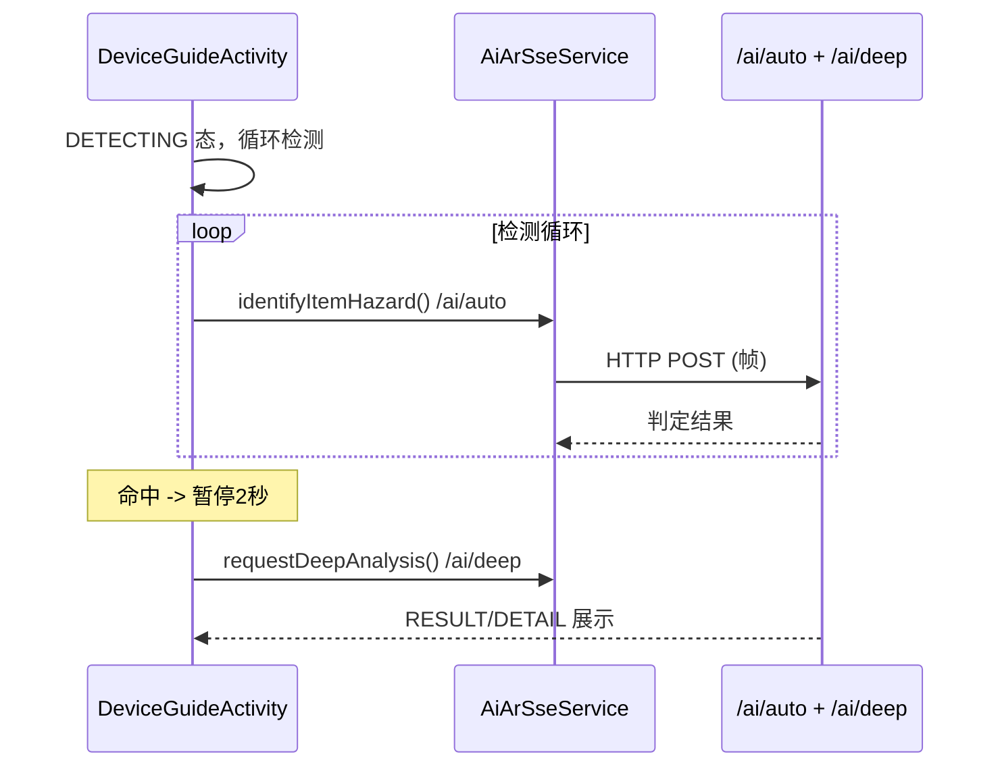

# CODEMAPS -- 模块关系地图

> 三层文档体系：CLAUDE.md (L1缓存) -> 本文档 (L2内存) -> 模块README (L3硬盘)
> 本文档描述模块间的关系、数据流、边界规则。模块内部细节见各 README。
>
> 最后更新: 2026-05-27

---

## 1. 架构层级图

应用采用五层架构，自上而下为页面层、会话层、输入层、相机层、识别链路层。
每层只依赖下层（或其抽象），不反向引用。



**层级职责一句话**：

| 层 | 职责 | 核心类/文件 |
|---|------|------------|
| 页面层 | Activity 生命周期、UI 渲染、用户交互响应 | 6个 Activity (见 hiddenrisk/README) |
| 会话层 | 全局巡检状态共享，避免重复初始化 | `InspectionSession`, `InspectionWorkflowSession` |
| 输入层 | 多模态输入统一抽象和分发 | `UnifiedInput`, `AutoSleepStateMachine` |
| 相机层 | 相机生命周期、帧流捕获和恢复 | `QuickCameraManager`, `RokidFrameSource` |
| 识别链路层 | 双轨推理调度、本地NCNN推理、在线SSE推理 | `AutoHazardPipelineDecider`, `HiddenRiskNcnn`, `AiArSseService` |

---

## 2. 模块依赖矩阵

### 模块一览

| 模块 | 包路径 | README | 类型 | 文件数 |
|------|--------|--------|------|--------|
| hiddenrisk | `com.rokid.glass.hiddenrisk` | [README](app/src/main/java/com/rokid/glass/hiddenrisk/README.md) | 业务核心 | ~50 |
| camera | `com.rokid.glass.camera` | [README](app/src/main/java/com/rokid/glass/camera/README.md) | 基础设施 | 3 |
| input | `com.rokid.glass.input` | [README](app/src/main/java/com/rokid/glass/input/README.md) | 基础设施 | 5 |
| workflow | `com.rokid.glass.workflow` | [README](app/src/main/java/com/rokid/glass/workflow/README.md) | 业务上下文 | 1 |
| component | `com.rokid.glass.component` | [README](app/src/main/java/com/rokid/glass/component/README.md) | UI组件库 | 8 |
| config | `com.rokid.glass.config` | [README](app/src/main/java/com/rokid/glass/config/README.md) | 配置系统 | 2 |
| network | `com.rokid.glass.network` | -- | 基础设施 | 1 |
| updater | `com.rokid.glass.updater` | -- | 功能模块 | 4 |
| utils | `com.rokid.glass.utils` | -- | 工具库 | ~12 |
| data | `com.rokid.glass.data` | -- | 全局状态 | 2 |
| jni | `app/src/main/jni/` | [README](app/src/main/jni/ncnn/README.md) | 原生推理 | 4(+ncnn) |

### 依赖关系图



**解读**：
- `hiddenrisk/` 是依赖的汇聚点：几乎依赖所有其他模块，是业务编排层
- `workflow/` 零依赖，是纯内存状态容器
- `camera/` 和 `input/` 仅依赖 Android 平台 API，是纯基础设施
- 依赖方向严格：业务模块 -> 基础设施，从未反向

### 模块间协议/约定

| 接口 | 提供方 | 消费方 | 格式/约定 |
|------|--------|--------|-----------|
| 帧流 | `camera/` QuickCameraManager | `hiddenrisk/` 所有推理链路 | HardwareBuffer -> NV21 bitmap (640x640) |
| 统一输入 | `input/` UnifiedInputSession | `hiddenrisk/` 各 Activity | `InputActionSpec(action, trigger, pageState)` |
| 巡检上下文 | `workflow/` InspectionWorkflowSession | `hiddenrisk/` 各 Activity | `EnterpriseQrPayload`, sessionId, 检测记录 |
| 推理配置 | `config/` InspectionConfigRepository | `hiddenrisk/` 所有推理组件 | `InspectionAppConfig` (JSON deserialized) |
| JNI 推理 | `jni/` HiddenRiskNcnn.detect() | `hiddenrisk/` InspectionSession | NV21帧 -> `DetectionResult[]` |
| SSE 通信 | `hiddenrisk/` AiArSseService | `hiddenrisk/` OnlineHazardDetectionService | OkHttp SSE -> `ResolvedHazardContent` |
| HTTP 客户端 | `network/` HttpClientProvider | `hiddenrisk/`, `updater/` | OkHttpClient (单例) |

---

## 3. 端到端数据流

### 3.1 核心链路：初始化 -> 自动检测



### 3.2 核心链路：在线 SSE 推理（主链路）



### 3.3 核心链路：本地 NCNN 推理（fallback）



### 3.4 核心链路：隐患上传 -> 手机端同步



### 3.5 辅助链路：隐患拍照录入



### 3.6 辅助链路：设备指引判定



---

## 4. 架构不变量与边界规则

| # | 规则 | 原因 |
|---|------|------|
| R1 | **相机帧流只通过 InspectionSession 获取**，Activity 不直接持有 Camera 引用 | 避免多页面帧流抢占；`InspectionCameraCoordinator` 统一管理 acquire/release |
| R2 | **hiddenrisk/ 是唯一依赖汇聚点**，其他模块间不产生新的直接依赖 | 保持依赖图单向无环；新增跨模块依赖需同步更新本文档 |
| R3 | **JNI 调用只能通过 HiddenRiskNcnn.java**，Kotlin 代码不直接声明 native 方法 | JNI 签名集中在单一桥接层，降低接口变更的同步成本 |
| R4 | **NCNN param + bin 必须成对替换**，不允许只换一个 | 两次不同的导出会产生不兼容的模型结构，导致推理崩溃 |
| R5 | **配置只从 InspectionConfigRepository 读取**，禁止硬编码推理参数/API 端点 | 保证风味覆盖机制生效，避免"改了配置不生效"的调试陷阱 |
| R6 | **input/ 的 HEAD_GESTURE_LISTENING_ENABLED 当前全局关闭**，不要在生产代码中重新开启 | 头部手势尚未充分验证稳定性，误触发会干扰用户体验 |
| R7 | **上传前必须按 hidNum 去重，跳过空 hidNum** | `LocalHazardUploadItemBuilder.build()` 的职责，防止重复推送和空数据浪费带宽 |

---

## 5. 关键术语表

| 术语 | 含义 | 涉及模块 |
|------|------|----------|
| 双轨推理 | 同时运行本地 NCNN 和在线 SSE 两套推理链路 | hiddenrisk |
| DETECTING | AiInspectionActivity 自动检测态，持续截帧送检 | hiddenrisk |
| STREAM_RESPONSE | SSE 流式返回阶段，DESCRIPTION(确认) -> ADVICE(建议) | hiddenrisk |
| NCNN | 腾讯开源的高性能神经网络推理框架，本项目用 Vulkan GPU 后端 | jni, hiddenrisk |
| SSE | Server-Sent Events，OkHttp 实现的长连接流式协议，用于在线推理 | hiddenrisk |
| EnterpriseQrPayload | 企业扫码后解析的上下文 (authCode, objectId, userId, apiBaseUrl) | workflow |
| GpuFrame | HardwareBuffer 包装的 GPU 帧数据，用于 NCNN 推理输入 | camera, hiddenrisk |
| InspectionSession | 全局巡检单例，持有 NCNN 模型引用、帧流、初始化标记 | hiddenrisk |
| InspectionWorkflowSession | 跨页面业务上下文，记录企业信息、检测结果、上传历史 | workflow |
| 隐患白名单 | 16 类预定义隐患类别（燃气灶、灭火器、消火栓、电动车等） | hiddenrisk, jni |
| Dedup 去重 | 本地推理结果基于类别+位置消重，避免同一物体重复报警 | hiddenrisk |
| 风味覆盖 | Gradle flavor 机制，不同构建变体可覆盖配置项 | config |
| Vulkan | Android GPU 计算 API，NCNN 使用 Vulkan 后端进行端侧推理加速 | jni |

---

## 6. 常见任务入口速查

| 任务类型 | 起点文件 | 相关文档 |
|----------|----------|----------|
| 新增一个巡检页面 Activity | `hiddenrisk/AiInspectionActivity.kt` (参考) + `hiddenrisk/BaseGlassActivity.kt` (基类) | hiddenrisk/README.md |
| 修改本地 NCNN 推理参数 | `config/InspectionAppConfig.kt` (配置定义) + `hiddenrisk/HiddenRiskNcnn.java` (JNI调用) | config/README.md, hiddenrisk/README.md |
| 替换 NCNN 模型 | `jni/yolov8ncnn.cpp` (后处理) + `assets/hiddenrisk.ncnn.param` + `assets/hiddenrisk.ncnn.bin` | models/README.md |
| 新增在线 API 端点 | `hiddenrisk/AiArSseService.kt` (SSE请求) + `config/InspectionAppConfig.kt` (端点配置) | hiddenrisk/README.md |
| 增加隐患类别(白名单) | `jni/yolov8_det.cpp` (类别映射) + 重新训练/导出模型 | models/README.md |
| 修改输入层动作映射 | `hiddenrisk/<Activity>.kt` 中的 `buildInputActions()` | input/README.md |
| 调整相机预览/帧流 | `camera/QuickCameraManager.kt` + `component/RokidCameraPreviewView.kt` | camera/README.md, component/README.md |
| 修改上传重试策略 | `hiddenrisk/InspectionRetryExecutor.kt` | hiddenrisk/README.md |
| 新增可复用 UI 组件 | `component/` 目录，参考 `GlassStatusBar.kt` 或 `BottomPromptView.kt` | component/README.md |
| 添加运行时配置项 | `config/InspectionAppConfig.kt` (字段) + `assets/inspection_config.base.jsonc` (默认值) | config/README.md |
| 修改 QR 码解析格式 | `workflow/InspectionWorkflowSession.kt` 中 `updateEnterpriseFromQr()` | workflow/README.md |
| 调试 NCNN 推理问题 | `hiddenrisk/HiddenRiskProbeActivity.kt` (探针页) + adb logcat 过滤 `detect ` | hiddenrisk/README.md |
| App 版本更新流程 | `updater/AppUpdateManager.kt` (入口) + `updater/AppUpdatePromptActivity.kt` (UI) | 见源码注释 |

---

## 附录 A：NCNN 模型流水线（参考）

- 当前部署源：`models/source/hidden_risk_mini_0330.onnx`
- 完整训练资产：`models/source/best.pt`
- 导出链路：`.pt -> torchscript(imgsz=640) -> pnnx(fp16=1) -> ncnn`
  或 `.onnx -> pnnx(fp16=1) -> ncnn`
- 原生侧统一读取 blob `out0_raw`；C++ 后处理兼容 raw (64+26) 和 decoded (4+26) 两种 proposal
- 当前 mini 模型输出 `1x30x8400`（decoded 分支）
- 已验证可运行 GPU 组合：`640` 输入尺寸、`System Vulkan`、`Balanced FP16`、`lightmode=true`、`local_pool_allocator=true`

## 附录 B：推理调试关键日志

- `detect preprocess target=640`
- `detect padded ... anchors=8400`
- `detect ex.extract done blob=out0_raw`

GPU 稳定性排查顺序：
1. 检查 `TARGET_INPUT_SIZE=640`
2. 检查 `GPU_PROFILE=Balanced FP16`
3. 检查 `lightmode/local_pool_allocator`
4. 区分是 ncnn 推理失败还是 UI/探针页自身崩溃

## 附录 C：AI 辅助工具速查

本项目配置了 LSP (Serena) 和 CodeGraph 两套代码智能工具。

| 任务类型 | 首选工具 | 原因 |
|----------|----------|------|
| 初次接触陌生模块 | CodeGraph | 一次调用返回入口点+相关符号+片段 |
| 获取文件结构概览 | Serena | `get_symbols_overview` 精确列出所有符号 |
| 查找函数/类定义 | Serena | LSP 精确跳转，支持重载辨析 |
| 查找所有引用 | Serena | 语义级引用，过滤字符串同名噪声 |
| 跨模块调用链分析 | CodeGraph | 预计算调用图，减少多次往返 |
| 影响半径评估 | CodeGraph | `codegraph_impact` 一键返回影响范围 |
| 批量文本搜索 | Grep | 简单直接，无需语义分析 |
| 重命名符号 | Serena | LSP 提供安全的跨文件重构 |

CodeGraph 索引位于 `.codegraph/`（已加入 `.gitignore`），如需强制重建：
```bash
npx codegraph index
```
