# 智能眼镜如何用单目摄像头定位现实物体：从二维检测框到空间叠加

设想这样一个画面：智能眼镜识别出视野中的设备、仪表或安全隐患，并把一个透明检测框叠加到真实物体上。佩戴者转动视线时，框看起来依然属于那个物体，而不是悬浮在屏幕上的某个固定位置。

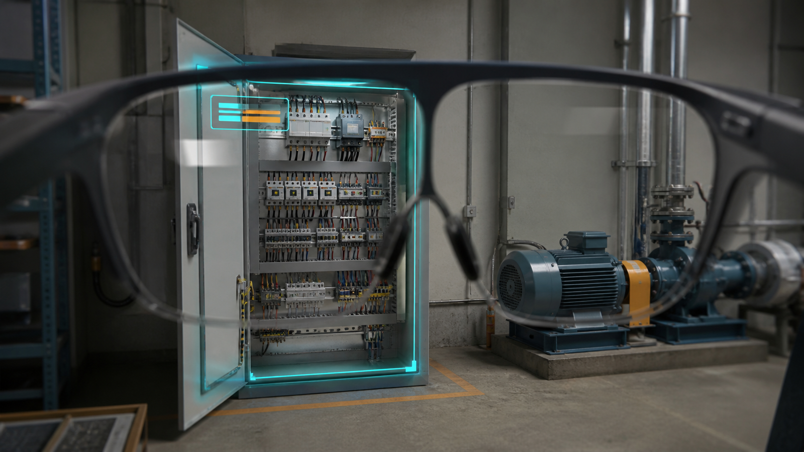

这类效果常被简单描述为“把目标检测框画到眼镜屏幕上”，但真正的问题远比二维绘制复杂。摄像头看到的像素、目标在三维空间中的位置、眼睛看出去的方向以及显示屏上的像素，分属不同坐标系。只有把这些坐标系逐一连接起来，数字标记才可能与现实目标基本重合。

本文结合一套智能眼镜原型的实验过程，介绍我们为什么没有直接采用完整 SLAM，以及如何从低成本的简化模型起步，逐步引入中心偏差与动态深度，最终逼近完整的空间投影。文中重点讨论通用原理和工程方法，不涉及具体设备参数。


## 一、先定义问题：我们究竟在定位什么

“物体定位”在这类系统中至少包含三层含义：

1. **图像中的二维定位**：目标检测模型返回物体在摄像头图像中的 `bbox`。
2. **相机坐标系中的三维定位**：根据像素方向和目标深度，恢复目标相对摄像头的位置。
3. **佩戴者视野中的显示定位**：将三维目标转换为眼睛的观察方向，再找到眼镜显示屏上的绘制位置。

普通 YOLO 一类检测模型做到的只是第一层。它可以告诉我们物体位于图像的左上方还是右下方，却不能直接告诉我们应该在眼镜屏幕的哪个像素画框。

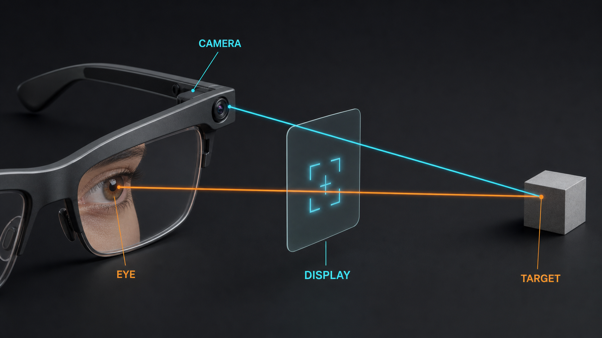

完整链路可以概括为：

```text
camera pixel + depth -> 3D point -> eye ray -> display pixel
```

## 二、标准方案是 SLAM，但它的成本很高

增强现实中的标准空间定位方案通常以 SLAM（Simultaneous Localization and Mapping，同时定位与建图）为基础。它一边构建场景地图，一边估计设备自身在空间中的位置与朝向（即六自由度位姿），并把虚拟内容锚定在一个可持续维护的世界坐标系（以真实场景为基准的固定坐标系）中。

如果目标是让一个标记长期固定在房间中的某个位置，即使佩戴者离开后再次回来，标记仍能出现在原处，那么 SLAM 是合理的技术基础。但它同时引入了一整套硬件与工程成本：

- 单目视觉 SLAM 存在尺度不确定性：仅凭一只移动的相机，很难直接算出“物体离我几米”的绝对距离，可靠的公制尺度通常需要 IMU（惯性测量单元）、双目或深度传感器协助；
- 相机与 IMU 需要精确同步，并标定两者的相对位置关系（外参）；
- 系统要长期维护整套场景地图状态，包括关键帧、地图点、回环检测和重定位；
- 弱纹理、重复纹理、动态场景和快速运动可能导致跟踪失败；
- 持续定位会与目标检测、深度估计争夺眼镜端有限的算力、内存与功耗预算；
- 即使 SLAM 给出了相机或 IMU 的位姿，仍然需要 Camera-to-Eye 标定（眼睛与摄像头的相对位置关系）和 Display Calibration（显示标定），才能在眼镜上正确显示。

而我们的目标更窄：不构建长期世界地图，也不要求跨时间维持空间锚点（长期固定在空间中的标记），只希望在当前画面中，让目标检测结果与佩戴者看到的现实物体基本重合。

因此，我们把问题从“持续维护整个世界坐标系”，收窄为“只完成当前这一帧的 Camera → Eye → Display 映射”。这正是简化方案的技术初衷：使用眼镜已有的单目摄像头，以更低的硬件、算力和工程成本，换取当前视野内可用的现实标注能力。

## 三、简化方案的核心方法：每次只解除一个假设

完整的空间投影同时涉及相机内参（相机如何把空间映射到画面）、目标深度、Camera-to-Eye 外参、显示光学和佩戴者眼位。一次接入所有变量，出现错位时很难确定问题来自哪一层。

我们的验证路线分为三个阶段：

```text
同中心、固定深度
        ↓
中心不一致、固定深度
        ↓
中心不一致、动态深度
        ↓
完整三维投影
```

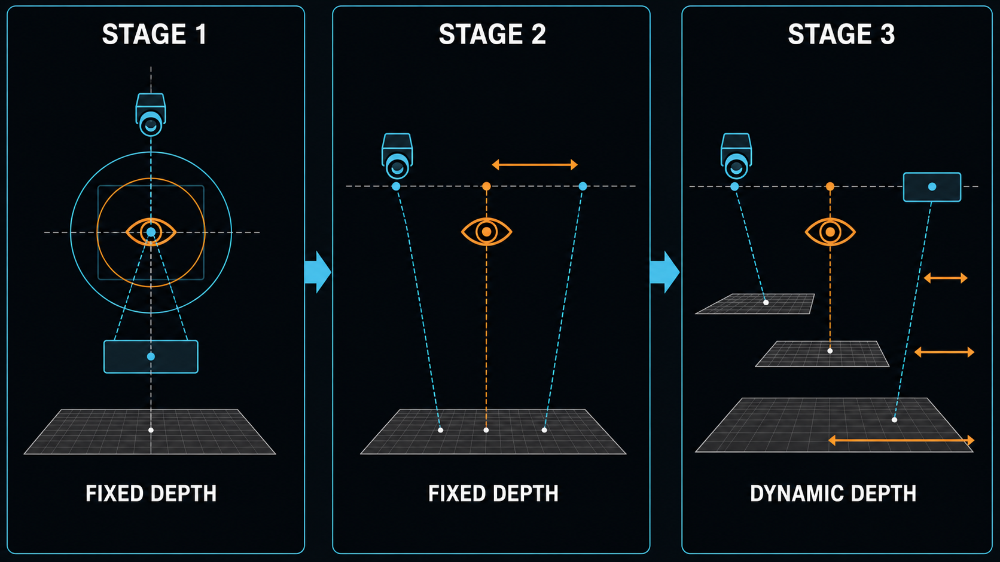

每个阶段只增加一个新的现实因素，并使用独立测试页面验证。这样既能逐步建立可用效果，也能为未来接入真实深度和完整标定保留清晰路径。

## 四、第一阶段：同中心、固定深度

第一阶段先作出最理想的假设：

- Camera 的光学中心、Display 的渲染中心与瞳孔观察中心重合；
- Camera 与 Display 朝向一致，不考虑相对旋转；
- 目标均位于同一个参考深度平面；
- 暂不考虑镜头畸变和显示光学畸变。

在这些条件下，不需要恢复目标三维位置，问题只剩下画面裁切、缩放和平移。

### 为什么不能按分辨率直接缩放

真正决定画面如何映射到屏幕的，不是分辨率本身，而是每个像素对应的观察角度。Camera 通常拥有较大的视场，Display 只覆盖佩戴者视野中的一小块区域。因此，不能把整幅 Camera 图像按分辨率压缩到屏幕，而应该从 Camera 大视场中截取 Display 视场对应的部分。

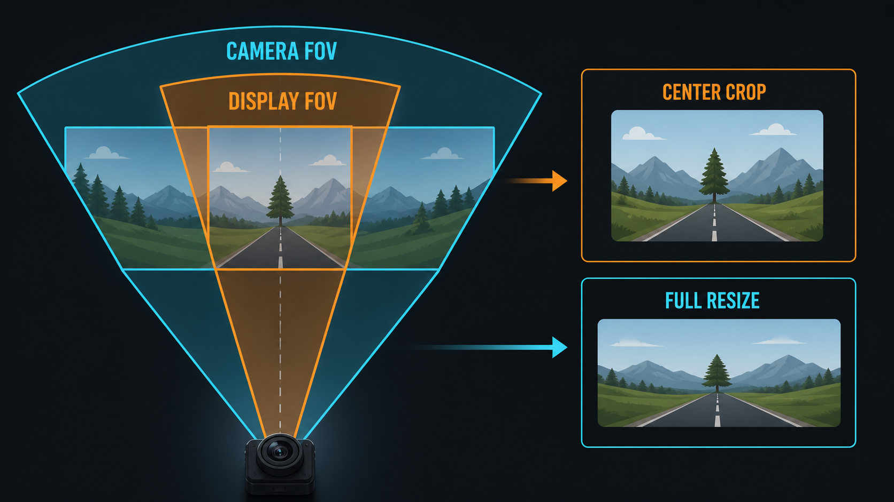

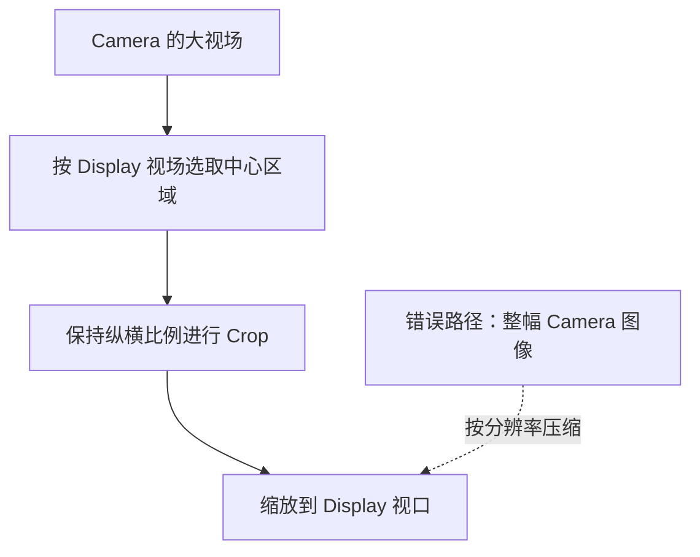

如果忽略视场差异，最常见的现象就是物体变胖、变瘦，或整体比例正确但位置明显不对。这不是绘图 API 的问题，而是坐标映射模型选错了。

### 裁切、缩放和平移

Camera Pixel 到 Display Pixel 可以近似为以中心为基准的缩放和平移：

$$
u_d-c_{dx}=(u_c-c_{cx})\frac{f_{dx}}{f_{cx}}+t_x
$$

$$
v_d-c_{dy}=(v_c-c_{cy})\frac{f_{dy}}{f_{cy}}+t_y
$$

其中，等效焦距由分辨率和对应方向的视场角得到。这里的 $t_x$ 和 $t_y$ 只处理裁切坐标原点、画面方向（镜像或旋转）和渲染视口的固定差异，不表示 Eye 与 Camera 位置不同所造成的视差。

### 用半透明预览验证基础映射

第一张测试页同时显示现实画面与半透明的 Camera Surface（相机预览画面）。通过对照现实物体的轮廓，可以依次检查画面方向、宽高轴、纵横比例、有效视场、缩放和平移。

抽象的坐标误差会表现为肉眼可见的“双影”，因此这一阶段不需要依赖目标检测或深度模型。它的目标不是一次解决空间定位，而是先确认最基础的 Camera-to-Display 画面映射正确。

## 五、第二阶段：中心不一致，但深度固定

真实眼镜中，Camera、Display 渲染中心和瞳孔中心通常不会重合：Camera 安装在镜框上，Display 光学中心由光机（投影成像组件）决定，瞳孔位置还会随用户和佩戴姿态变化。

第二阶段放宽“中心重合”的假设，但仍把目标限制在同一个参考深度平面。因为所有目标深度相同，Eye—Camera 基线在这个平面上造成的视差仍可以近似为固定补偿：

$$
u_d'=u_d+\Delta u_{ref}
$$

$$
v_d'=v_d+\Delta v_{ref}
$$

$\Delta u_{ref}$ 和 $\Delta v_{ref}$ 把以下因素在参考距离上的影响合并为一个固定偏移：

- Camera 光学中心与瞳孔中心的位置差；
- Display 渲染中心与瞳孔观察中心的偏差；
- Camera 主点与显示视觉中心的固定误差；
- 轻微光轴不平行和佩戴姿态误差。

这些因素在单个距离上通常无法唯一拆分，但不妨碍通过人工标定得到可用的总偏移。左右眼对应不同的观察中心，因此标定时还必须明确以哪只眼为准。

### 从半透明预览切换到只显示检测框

完成参考距离标定后，可以把 Camera Surface 的视觉透明度设为零，但 Surface 和相机会话仍继续工作。测试页从已经应用参考标定的 Surface 截取画面，发送给检测服务，再把同源图像上的 `bbox` 映射回透明的 Overlay（叠加图层）。

这样既能获得“现实中只有框和 Label”的最终体验，也能确保请求图像与 Overlay 共用同一个参考视口，避免重复施加 Camera-to-Display 变换。

此时，检测框在参考深度附近能够基本对齐。但目标一旦明显靠近或远离，固定补偿就会逐渐失效，这暴露出了下一阶段必须解决的问题。

## 六、第三阶段：中心不一致，目标深度动态变化

当 Camera 与 Eye 不在同一位置时，目标深度变化会改变两者看向目标的方向差异：近处视差大，远处视差小。

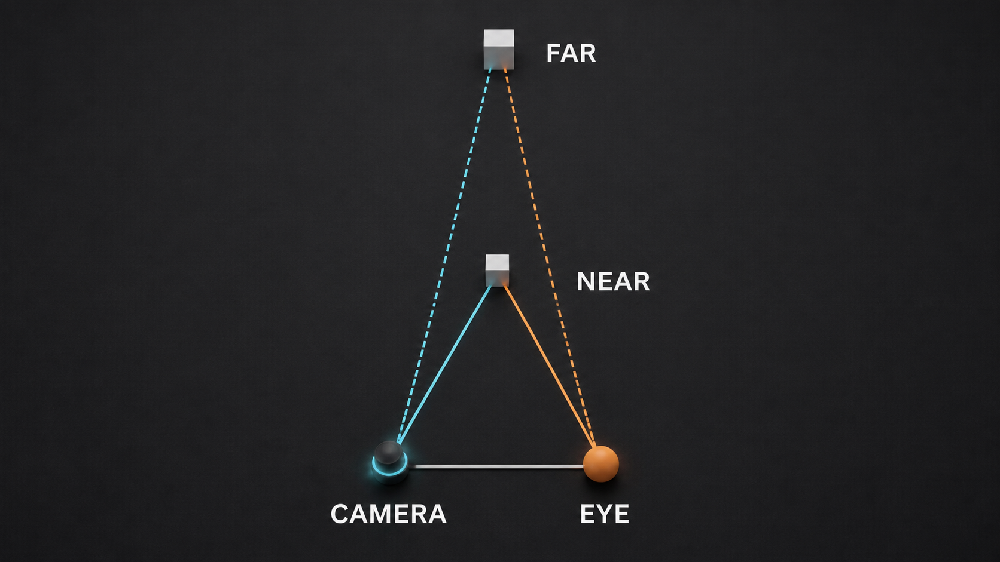

若 Eye 与 Camera 之间存在一段间距（基线）$b$，目标距离为 $Z$，在视差较小的情况下近似为：

$$
\Delta\theta\approx\frac{b}{Z}
$$

因此，参考距离上的固定偏移需要升级为随深度变化的函数。

### 1. 通过多距离实验建立补偿模型

在多个已知距离上重复人工对齐，并保持已经稳定的裁切、缩放以及垂直方向的固定偏移不变，只记录水平偏移的变化。如果变化主要来自水平 Eye—Camera 基线，它通常可以近似表示为：

$$
offsetX(Z)=C+\frac{K}{Z}
$$

$C$ 表示固定中心和光轴误差，$K/Z$ 表示随深度衰减的视差项。该公式是特定设备、佩戴方式和验证距离范围内的经验模型，不是完整光学标定的替代。

### 2. 用手动距离隔离验证动态补偿

在真实深度字段可用之前，可以固定请求画面的参考标定，手动切换目标距离，只让 Overlay 应用相对位移：

$$
\Delta x_{overlay}(Z)=offsetX(Z)-offsetX(Z_{ref})
$$

首轮只移动检测框中心，不改变框的垂直位置、宽度和高度。这样，如果对齐随距离得到改善，就能确认“动态深度驱动视差补偿”成立；如果结果不理想，也可以优先检查距离模型，而不是同时怀疑画面裁切或框尺寸变换。

### 3. 从统一距离升级到每个目标独立深度

手动距离只能验证模型。真实场景中，同一帧可能同时出现近处设备和远处设施，它们不能共享同一个深度值。

完整链路应让目标检测和深度估计处理同一帧，并为每个目标分别计算一个代表性深度：

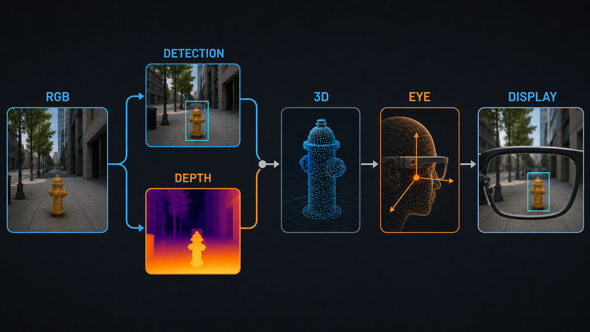

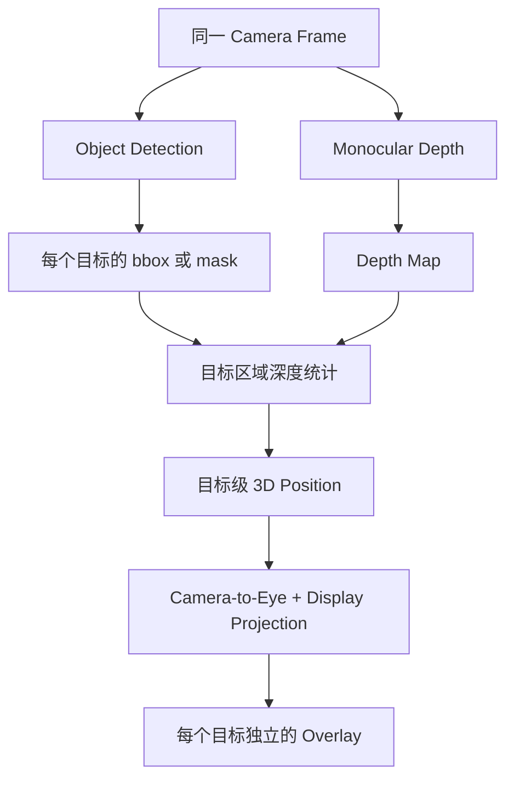

单目深度模型的输出通常分为两类：相对深度只说明物体之间的远近关系，不直接给出真实距离；空间补偿更需要的是能直接输出物理距离（以米为单位）的公制深度。

实际工程中，不应盲目使用 `bbox` 中心的单个深度值。更稳定的做法是在目标中心区域或 Mask 内取中位数、剔除异常值，并同时给出这个深度的可信程度。检测与深度还必须对应同一帧，否则头部运动时会产生明显错位。

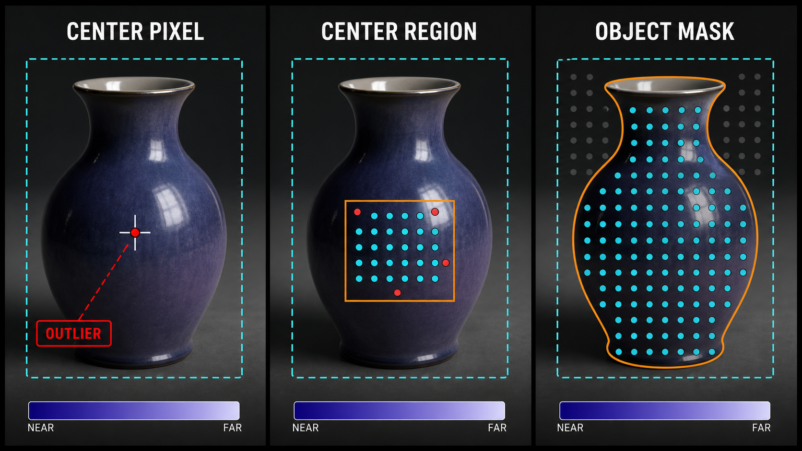

## 七、从经验补偿走向完整三维投影

前三个阶段验证了一个低成本的工程路径，但深度相关的二维偏移仍然是经验模型。要想让每一层都有明确的物理含义、并能迁移到其他设备或佩戴者，需要重新连接最初提到的三个坐标系。

这一段的完整链路只有四个环节，可以先记住一个直觉：像素反推出空间方向，深度决定远近，再把坐标转到 Eye，最后落到屏幕像素。下面逐一展开。

### 1. Camera Pixel 转换为 Camera Ray

针孔相机模型把相机简化为一个点，用内参矩阵 $K_c$ 描述焦距和主点（光轴与画面的交点）。对于齐次像素坐标 $\mathbf p_c=(u_c,v_c,1)^T$，对应的 Camera Ray（从相机出发、经过该像素的观察方向）为：

$$
\mathbf r_c=K_c^{-1}\mathbf p_c
$$

### 2. Depth 将射线变成三维点

如果目标代表深度为 $Z$，目标在 Camera 坐标系中的三维位置为：

$$
\mathbf P_c=Z\mathbf r_c=ZK_c^{-1}\mathbf p_c
$$

### 3. Camera 坐标转换到 Eye 坐标

设 Camera 到 Eye 的旋转和平移为 $R_{ec}$ 与 $\mathbf t_{ec}$：

$$
\mathbf P_e=R_{ec}\mathbf P_c+\mathbf t_{ec}
$$

将 $\mathbf P_e$ 归一化（只保留方向）后，就得到 Eye Ray（从 Eye 看向目标的射线）。

### 4. Eye Ray 映射到 Display Pixel

最后通过 Display Calibration，把 Eye Ray 投影到屏幕像素。真实光学显示还需要考虑有效视场、光学畸变、Eye Box（眼睛能在画面中清晰观察的移动范围）、左右主视眼（习惯用于看的那只眼）和佩戴姿态。

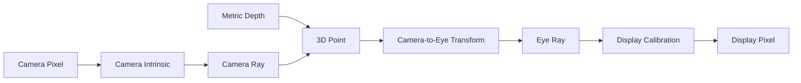

这套完整模型不再把所有误差都塞进一个二维偏移，而是让每个参数对应明确的物理含义。

## 八、动态深度是否应该改变框的大小

目标深度到手后，是否应该顺势把检测框再缩放一遍？这里很容易重复计算透视效果。

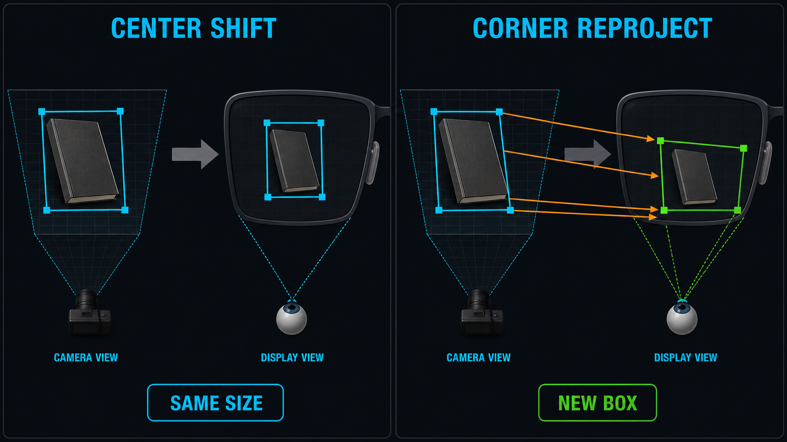

目标检测框来自 Camera 图像，它的大小已经包含相机透视：同一个物体靠近时框更大，远离时框更小。因此，在经验补偿阶段，不应看到一个深度值后就再次按 $1/Z$ 随意缩放整个框。

当前验证层级只根据目标深度调整框中心，宽高保持不变。进一步追求近距离边缘精度时，应把检测框角点、目标 Mask 边界或三维包围盒（包住目标的立体框）分别转换到 Eye 坐标系，再投影到 Display，最后重新计算屏幕上的包围框。此时框尺寸的变化来自完整几何投影，而不是额外套用一个经验缩放系数。

## 九、稳定性往往比单帧精度更影响体验

即使单帧位置很准，如果框在连续帧间不断跳动，佩戴者仍会认为系统没有对齐。工程实现还需要处理：

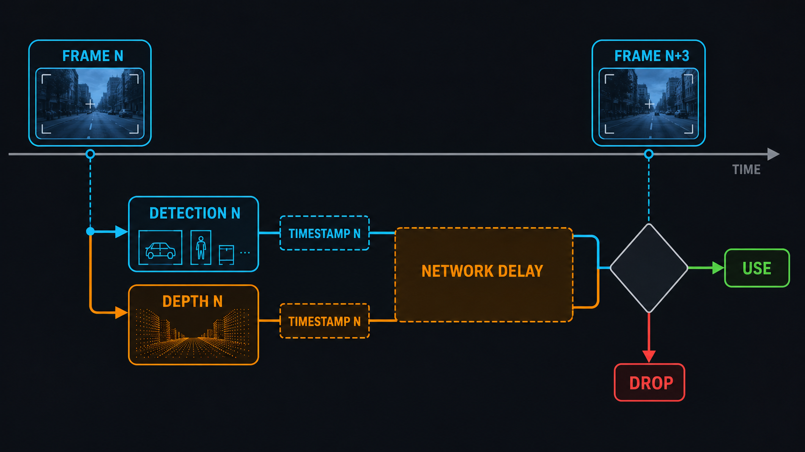

- **深度抖动**：对目标深度使用中位数、指数移动平均（EMA）或卡尔曼滤波；
- **检测框抖动**：对中心与边界进行时序平滑，或引入目标跟踪；
- **网络时延**：结果返回时应检查对应帧，过旧结果可丢弃或短暂保留后淡出；
- **头部运动**：采集帧与显示时刻的姿态差异越大，错位越明显；
- **目标遮挡**：短期丢失时可保持跟踪状态，但不能无限保留旧框；
- **佩戴变化**：眼镜位置变化会改变 Eye Box 和有效外参，需要支持快速重新标定。

在云端推理链路中，还要确保请求串行策略、超时取消和上一批结果的保留与丢弃规则是确定的。否则网络波动可能表现为框闪烁，而不只是延迟增加。

## 十、简化方案的边界：什么时候仍然需要 SLAM

简化方案解决的是“当前帧中的目标叠加”，SLAM 解决的是“跨时间、跨视角的世界坐标锚定”。两者不是精度不同的同一种方案，而是在解决不同范围的问题。

单目简化方案仍有明确边界：

- 单目深度依赖模型从大量图片学到的先验，在透明、反光、暗光和低纹理场景中可能失效；
- 公制模型仍可能存在整体尺度漂移（把距离整体放大或缩小的偏差）；
- `bbox` 中心不一定是物体的三维几何中心；
- 一套人工标定参数不能理所当然地适用于所有用户和佩戴姿态；
- 前文拟合出的倒数经验公式通常只在已经验证的距离范围内可靠；
- 仅靠当前 Camera Frame 和二维 Overlay，无法提供持续的世界坐标锚点（不会随时间丢失的固定位置标记）。

如果产品需要虚拟内容长期固定在世界坐标中、支持大范围移动后的重定位，或需要多设备共享空间地图，那么仍然应采用 SLAM，并进一步引入严格的传感器标定、IMU 与视觉融合，或主动式深度传感器。

## 十一、总结：用更低成本逐步逼近空间投影

这套方案的出发点不是取代 SLAM，而是在硬件、算力和工程成本受限时，把问题缩小到当前视野中的现实目标标注。

实现过程依次解除三个假设：

1. **同中心、固定深度**：只处理 Camera 画面的裁切、缩放和平移，并用半透明预览验证基础二维映射；
2. **中心不一致、固定深度**：在参考距离上标定 Camera、Eye 与 Display 中心差异，再隐藏预览，只显示检测框和 Label；
3. **中心不一致、动态深度**：通过多距离实验建立深度相关补偿，先用手动距离验证，再由单目深度为每个目标提供独立距离。

前三个阶段中的每一步都能单独测试。当真实深度能力接入时，系统不是从零开始，而是用模型返回的 $Z$ 替换人工输入，并继续沿已经验证的坐标链路向前推进。需要更高精度时，再把经验偏移升级为 Camera Intrinsic、Camera-to-Eye Extrinsic 和 Display Calibration 组成的完整三维投影。

真正让检测框“贴在现实世界上”的，不是某一个目标检测模型或某一条缩放公式，而是对像素、深度、眼位和显示光学四者关系的完整理解，以及对产品目标与工程成本之间边界的清醒选择。
