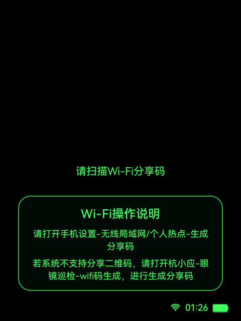

# WiFi连接

本文档是 `docs/功能模块/WiFi连接.md` 的单一正文真相源，收敛原先拆散在 `README`、`功能说明`、`页面说明`、`页面跳转`、`用户旅程`、`代码索引` 中的信息，并对齐当前代码与真机行为。

## 1. 功能目标

- 在企业巡检主链中完成 Wi-Fi 二维码扫描、配网、连接验证和成功后的后续跳转。
- 把网络模式写入 `InspectionWorkflowSession`，为后续企业扫码、对象信息拉取和正式功能页提供在线上下文。

## 2. 功能边界

- 本模块负责：
  - 读取 Wi-Fi 二维码。
  - 优先走系统配网入口，必要时回退到 `WifiNetworkSpecifier`。
  - 校验当前 SSID 是否真的切换到目标网络。
  - 成功后调用 `InspectionWorkflowSession.updateMode(connected = true)` 并跳转后续页。
- 本模块不负责：
  - 企业二维码解析。
  - 企业对象信息拉取与展示。
  - 主菜单分发和后续隐患识别逻辑。
- 本模块依赖：
  - [公共能力/会话与生命周期.md](../公共能力/会话与生命周期.md)
  - [公共能力/统一输入设计与接入.md](../公共能力/统一输入设计与接入.md)
  - `InspectionLoadingActivity`
  - `InspectionWorkflowSession`
  - `SystemStateUtils`
  - `WifiQrParser`

## 3. 用户旅程 / 主流程

1. `InspectionLoadingActivity` 在企业巡检开启且当前未连 Wi-Fi 时跳转到 `WifiQrScanActivity`。
2. 页面启动扫描循环，持续从共享帧流读取二维码。
3. 识别到合法 Wi-Fi 二维码后，停止扫描并解析 SSID、密码和安全类型。
4. 页面优先尝试系统配网入口；系统入口不可用时回退到 `WifiNetworkSpecifier`。
5. 配网结果返回后，页面轮询当前 SSID，确认是否真的连上目标网络。
6. 连接成功后，页面写入在线模式并展示成功态。
7. 页面根据 `EXTRA_NEXT_AFTER_SUCCESS` 跳转到后续页；当前正式主链通常进入 `EnterpriseQrScanActivity`。
8. 若二维码无效、权限缺失或连接失败，页面提示失败并允许重新扫描或退出。

## 4. 页面与状态总览

| 页面 | 状态 | 进入条件 | 退出条件 | 备注 |
| --- | --- | --- | --- | --- |
| `WifiQrScanActivity` | `SCANNING` | 页面创建或失败重试 | 识别到合法二维码 / 用户退出 | 默认扫描态 |
| `WifiQrScanActivity` | `WAITING_SYSTEM_RESULT` | 已唤起系统配网入口 | 系统返回 / 用户取消 | 等待系统结果 |
| `WifiQrScanActivity` | `VERIFYING_CONNECTION` | 系统返回或发起回退配网 | 验证成功 / 超时失败 | 轮询 SSID |
| `WifiQrScanActivity` | `CONNECTING_WITH_SPECIFIER` | 回退到 `WifiNetworkSpecifier` | 网络回调 / 超时失败 | 回退链路 |
| `WifiQrScanActivity` | `SHOWING_RESULT` | 成功或失败结果确定 | 成功继续后续页 / 失败重试 / 用户退出 | 结果展示态 |

## 5. 页面详情

## `WifiQrScanActivity`

### 页面职责

- 持续读取扫描帧并识别 Wi-Fi 二维码。
- 触发系统配网或回退配网流程。
- 校验目标 SSID 是否已接入。
- 成功后设置在线模式并跳转下一页。

### 进入条件

- `InspectionLoadingActivity` 初始化完成。
- 企业巡检开关开启。
- 当前未连接 Wi-Fi。

### 退出路径

- 连接成功后跳转到 `EXTRA_NEXT_AFTER_SUCCESS` 指定页面。
- 当前正式主链默认跳转到 `EnterpriseQrScanActivity`。
- 用户执行取消动作时直接退出应用任务。
- 连接失败时留在当前页，可通过确认动作重新扫描。

### 页面状态

- `SCANNING`
- `WAITING_SYSTEM_RESULT`
- `VERIFYING_CONNECTION`
- `CONNECTING_WITH_SPECIFIER`
- `SHOWING_RESULT`

### 关键 UI 元素

- 相机预览和扫码框。
- 扫描提示文案。
- 结果图标与结果态提示卡。
- 状态栏。

### 可见性约束

- `debug_snapshot=true` 时不执行真实扫描，只渲染静态态用于截图。
- 结果态会隐藏扫码框、扫描提示和底部提示。
- 失败结果态显示 `tvErrorDetail`，成功态隐藏该区域。

### 页面截图

#### `SCANNING`

- 对应状态：`SCANNING`
- 采集方式：真机关闭 Wi-Fi 后从应用启动链路进入 `WifiQrScanActivity`
- 采集设备：`RG_glasses` 真机

#### `SHOWING_RESULT / SUCCESS`

- 本轮未保留成功态真机截图。
- 原因：成功态需要真实配网成功后稳定停留在结果页，当前自动化只完成了扫描态补采。
- 补采要求：必须走真实配网成功链路，不接受调试直启替代图。

## 6. 交互定义

### 触控指令

| 动作 | 触发器 | 生效状态 | 注册位置 | 结果 |
| --- | --- | --- | --- | --- |
| `Confirm` | 单击 | `SCANNING`、`SHOWING_RESULT/SUCCESS` | `WifiQrScanActivity.buildInputActions()` | 扫描态重启扫描；成功态进入后续页 |
| `Cancel` | 返回、双击 | 全状态 | `WifiQrScanActivity.buildInputActions()` | 直接退出应用任务 |

### 语音指令

| 文本 | 拼音 | 动作 | 生效状态 | 注册位置 |
| --- | --- | --- | --- | --- |
| `确认` | `que ren` | `Confirm` | `SCANNING`、`SHOWING_RESULT/SUCCESS` | `WifiQrScanActivity.voiceTrigger()` |
| `确定` | `que ding` | `Confirm` | `SCANNING`、`SHOWING_RESULT/SUCCESS` | `WifiQrScanActivity.voiceTrigger()` |
| `继续` | `ji xu` | `Confirm` | `SCANNING`、`SHOWING_RESULT/SUCCESS` | `WifiQrScanActivity.voiceTrigger()` |
| `返回` | `fan hui` | `Cancel` | 全状态 | `WifiQrScanActivity.voiceTrigger()` |
| `取消` | `qu xiao` | `Cancel` | 全状态 | `WifiQrScanActivity.voiceTrigger()` |

### 头部动作

- 当前未声明头部动作触发器。
- 原因：`UnifiedInputSession` 全局常量 `HEAD_GESTURE_LISTENING_ENABLED = false`。

## 7. 页面跳转与路由规则

| 来源页面 | 条件 / 动作 | 目标页面 | 失败 / 回退 |
| --- | --- | --- | --- |
| `InspectionLoadingActivity` | 企业巡检开启且未连接 Wi-Fi | `WifiQrScanActivity` | 无 |
| `WifiQrScanActivity` | 合法二维码 + 连接成功 | `EXTRA_NEXT_AFTER_SUCCESS` 指定页 | 当前正式主链为 `EnterpriseQrScanActivity` |
| `WifiQrScanActivity` | 二维码无效 | 留在 `WifiQrScanActivity` | 冷却后恢复扫描 |
| `WifiQrScanActivity` | 权限被拒绝 | 留在 `WifiQrScanActivity` | 提示权限不足 |
| `WifiQrScanActivity` | 连接验证失败 | 留在 `WifiQrScanActivity` | 进入失败结果态，确认后重试 |
| `WifiQrScanActivity` | 返回 / 取消 | 退出任务 | 无 |

## 8. 后端与数据链路

## 链路 A：Wi-Fi 二维码解析

- 接口用途：从当前帧中解析 Wi-Fi SSID、密码和安全类型。
- 触发时机：扫描态定时从 `RokidFrameSource.copyLatestScanFrame()` 读取帧后执行。
- 调用入口代码：
  - `WifiQrScanActivity.scanRunnable`
  - `BarcodeScanning.getClient(...)`
  - `WifiQrParser`
- 请求来源数据：共享扫描帧 `NV21` 图像。
- 关键输入字段：
  - 二维码原始文本。
  - Wi-Fi 安全类型。
  - SSID / password。
- 成功后的页面 / 会话更新：
  - 页面停止扫描并进入配网链路。
  - 记录 `pendingPayload`。
- 失败后的降级、回退、提示：
  - 非法二维码进入冷却窗口后恢复扫描。
  - 不支持的安全类型提示失败并恢复扫描。
- 日志锚点：
  - `scan failed`
  - `reset to scanning`

## 链路 B：系统配网与连接验证

- 接口用途：把解析出的 Wi-Fi 信息交给系统并确认最终连接成功。
- 触发时机：二维码解析成功后立即执行。
- 调用入口代码：
  - `WifiQrScanActivity.handleScanResult(...)`
  - `addNetworksLauncher`
  - `startVerification(...)`
  - `handleConnectionVerified(...)`
- 请求来源数据：
  - `WifiQrPayload.ssid`
  - `WifiQrPayload.password`
  - `WifiQrPayload.securityType`
- 关键请求字段：
  - 系统配网入口参数。
  - `WifiNetworkSpecifier` 的 SSID 和凭据。
- 关键响应字段：
  - 当前系统 SSID。
  - `Activity.RESULT_*`。
  - 网络回调结果。
- 成功后的页面 / 会话更新：
  - `InspectionWorkflowSession.updateMode(connected = true)`
  - 进入成功结果态。
  - 根据 `EXTRA_NEXT_AFTER_SUCCESS` 跳转下一页。
- 失败后的降级、回退、提示：
  - 系统配网入口不可用时回退到 `WifiNetworkSpecifier`。
  - 验证超时进入失败结果态。
  - 失败确认后回到扫描态。
- 日志锚点：
  - `add networks result`
  - `verify tick`
  - `verify timeout`
  - `private/system wifi flow returned`

## 9. 会话与本地状态

- `InspectionWorkflowSession.workflowMode`
  - `updateMode(connected = true)` 在连接成功后写入。
  - 后续企业扫码和业务页据此判断当前在线 / 离线模式。
- 页面内状态：
  - `connectionStage`
  - `pendingPayload`
  - `activeStrategyName`
  - `resultWasSuccess`
- 配置来源：
  - `InspectionLoadingActivity.EXTRA_NEXT_AFTER_SUCCESS`
  - `SystemStateUtils.getCurrentWifiSsid(...)`

## 10. 代码真相源

- 页面真相源：
  - `app/src/main/java/com/rokid/glass/WifiQrScanActivity.kt`
- 输入真相源：
  - `WifiQrScanActivity.buildInputActions()`
  - `app/src/main/java/com/rokid/glass/input/UnifiedInput.kt`
- 接口真相源：
  - `WifiQrScanActivity.addNetworksLauncher`
  - `WifiQrScanActivity.startVerification()`
  - `WifiQrScanActivity.handleConnectionVerified()`
- 会话真相源：
  - `app/src/main/java/com/rokid/glass/workflow/InspectionWorkflowSession.kt`
- 配置真相源：
  - `SystemStateUtils`
  - `WifiQrParser`

## 11. 异常与降级分支

- 权限拒绝：
  - 页面停留当前页。
  - 提示权限不足。
  - 开发重点检查 `onRequestPermissionsResult()` 和系统权限弹窗。
- 非法二维码：
  - 页面显示无效提示后恢复扫描。
  - 开发重点检查 `WifiQrParser` 返回值和冷却时间。
- 系统配网入口不可用：
  - 回退到 `WifiNetworkSpecifier`。
  - 开发重点检查私有入口列表和系统版本差异。
- 连接验证超时：
  - 页面进入失败结果态。
  - 开发重点检查当前 SSID 和 `VERIFY_TIMEOUT_MS`。
- 相机或扫描帧不可用：
  - 页面无法继续扫描。
  - 开发重点检查 `RokidFrameSource` 和相机恢复日志。

## 12. 开发检查清单

- [ ] `InspectionLoadingActivity` 未联网分支确实进入 `WifiQrScanActivity`
- [ ] 成功连接后调用了 `InspectionWorkflowSession.updateMode(connected = true)`
- [ ] `EXTRA_NEXT_AFTER_SUCCESS` 在正式主链下指向 `EnterpriseQrScanActivity`
- [ ] `Confirm` / `Cancel` 触发器与 `UnifiedInputSession` 注册一致
- [ ] 非法二维码、权限拒绝、连接超时都能留在当前页并给出可恢复反馈
- [ ] 真机截图覆盖扫描态和成功结果态
