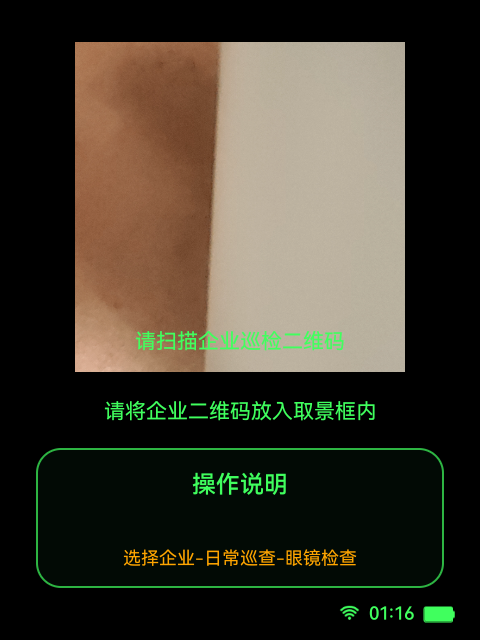

# 任务关联

关联总架构：[architecture.md](../architecture.md)

关联公共能力：

- [公共能力/会话与生命周期.md](../公共能力/会话与生命周期.md)
- [公共能力/页面导航分层.md](../公共能力/页面导航分层.md)

关联旅程图：[总体旅程图/任务关联旅程图.md](../总体旅程图/任务关联旅程图.md)

本文档是 `docs/功能模块/任务关联.md` 的单一正文真相源，收敛企业二维码扫描、对象信息拉取、企业信息确认和进入主菜单的实现基线，并对齐当前代码与真机行为。

## 1. 功能目标

- 把企业二维码与企业对象信息绑定到当前巡检会话。
- 在正式功能开始前完成企业对象确认，并把企业上下文写入 `InspectionWorkflowSession`。

## 2. 功能边界

- 本模块负责：
  - 企业二维码扫描与解析。
  - 企业对象信息接口调用。
  - 企业信息展示与确认。
  - 把企业二维码上下文和对象信息写入 `InspectionWorkflowSession`。
- 本模块不负责：
  - Wi-Fi 配网。
  - 主菜单分发之后的功能执行。
  - 巡检结束汇总。
- 本模块依赖：
  - [公共能力/会话与生命周期.md](../公共能力/会话与生命周期.md)
  - [公共能力/统一输入设计与接入.md](../公共能力/统一输入设计与接入.md)
  - `InspectionWorkflowSession`
  - `EnterpriseObjectMessageService`

## 3. 用户旅程 / 主流程

1. 用户完成网络准备后，系统进入 `EnterpriseQrScanActivity`。
2. 页面持续扫描企业二维码。
3. 二维码解析成功后，页面把二维码上下文写入 `InspectionWorkflowSession.enterpriseQrPayload`。
4. 页面使用二维码中的 `baseUrl`、`authCode`、`objectId` 调对象信息接口。
5. 接口成功返回后，页面写入 `InspectionWorkflowSession.enterpriseInfo` 并跳转到 `EnterpriseInfoActivity`。
6. 用户确认企业信息后进入 `AiInspectionMenuActivity`。
7. 用户取消时直接退出当前任务。

## 4. 页面与状态总览

| 页面 | 状态 | 进入条件 | 退出条件 | 备注 |
| --- | --- | --- | --- | --- |
| `EnterpriseQrScanActivity` | `SCANNING` | 页面创建且无缓存二维码 | 成功解析二维码 / 用户退出 | 默认态 |
| `EnterpriseQrScanActivity` | `LOADING_OBJECT_INFO` | 二维码解析成功并开始拉取对象信息 | 请求成功 / 请求失败 | 扫码态继续承载加载反馈 |
| `EnterpriseQrScanActivity` | `SUCCESS_RESULT` | 调试态或请求成功后展示结果 | 确认进入企业信息页 | 真实链路会直接导航 |
| `EnterpriseInfoActivity` | `DISPLAYING_INFO` | 对象信息已写入会话或 debug 数据存在 | 确认进入主菜单 / 取消退出 | 单页面信息确认页 |

## 5. 页面详情

## `EnterpriseQrScanActivity`

### 页面职责

- 从共享帧流持续扫描企业二维码。
- 解析并校验二维码内容。
- 拉取企业对象信息并更新会话。

### 进入条件

- 企业巡检开关开启。
- 已完成 Wi-Fi 准备，或 `InspectionLoadingActivity` 检测到已联网。

### 退出路径

- 扫码并获取对象信息成功后进入 `EnterpriseInfoActivity`。
- 返回 / 取消时退出应用任务。

### 页面状态

- `SCANNING`
- `LOADING_OBJECT_INFO`
- `SUCCESS_RESULT`

### 关键 UI 元素

- 相机预览和二维码框。
- 扫描提示文案。
- 成功结果态卡片。

### 可见性约束

- `debug_snapshot=true` 时不执行真实扫码。
- `debug_state=success` 时渲染成功结果态。
- 结果态隐藏扫码框和信息卡。

### 页面截图

#### `SCANNING`

- 对应状态：`SCANNING`
- 采集方式：真机完成联网准备后，从正式启动链路进入 `EnterpriseQrScanActivity`
- 采集设备：`RG_glasses` 真机

#### `SUCCESS_RESULT`

- 本轮未保留成功结果态真机截图。
- 原因：成功态会快速继续跳入 `EnterpriseInfoActivity`，当前自动化未稳定截停在该过渡态。

## `EnterpriseInfoActivity`

### 页面职责

- 展示企业名称、场所码、区域、类别、风险标签、风险等级、历史隐患和最近巡查时间。
- 作为进入主菜单前的最终确认页。

### 进入条件

- `EnterpriseQrScanActivity` 成功获取对象信息。
- 或通过 debug 数据直启。

### 退出路径

- 确认进入 `AiInspectionMenuActivity`。
- 返回 / 取消直接退出任务。

### 页面状态

- `DISPLAYING_INFO`

### 关键 UI 元素

- 企业名称。
- 场所码。
- 区域、类别、风险标签、风险等级。
- 历史隐患列表。
- 最近巡查时间。
- 状态栏。

### 可见性约束

- `debug_*` extras 存在时，优先渲染调试企业信息而不依赖真实会话。

### 页面截图

- 本轮未保留 `EnterpriseInfoActivity` 真机截图。
- 原因：该页是非导出页，且需要前序扫码与对象信息会话态；当前自动化未稳定构造到该页面。
- 补采要求：必须从 `EnterpriseQrScanActivity` 成功获取对象信息后真实进入。

## 6. 交互定义

## `EnterpriseQrScanActivity`

### 触控指令

| 动作 | 触发器 | 生效状态 | 注册位置 | 结果 |
| --- | --- | --- | --- | --- |
| `Confirm` | 单击 | `SCANNING`、`SUCCESS_RESULT` | `EnterpriseQrScanActivity.buildInputActions()` | 扫描态重启扫描；成功态进入信息页 |
| `Cancel` | 返回、双击 | 全状态 | `EnterpriseQrScanActivity.buildInputActions()` | 退出任务 |

### 语音指令

| 文本 | 拼音 | 动作 | 生效状态 | 注册位置 |
| --- | --- | --- | --- | --- |
| `确认` | `que ren` | `Confirm` | `SCANNING`、`SUCCESS_RESULT` | `EnterpriseQrScanActivity.voiceTrigger()` |
| `确定` | `que ding` | `Confirm` | `SCANNING`、`SUCCESS_RESULT` | `EnterpriseQrScanActivity.voiceTrigger()` |
| `继续` | `ji xu` | `Confirm` | `SCANNING`、`SUCCESS_RESULT` | `EnterpriseQrScanActivity.voiceTrigger()` |
| `返回` | `fan hui` | `Cancel` | 全状态 | `EnterpriseQrScanActivity.voiceTrigger()` |
| `取消` | `qu xiao` | `Cancel` | 全状态 | `EnterpriseQrScanActivity.voiceTrigger()` |

## `EnterpriseInfoActivity`

### 触控指令

| 动作 | 触发器 | 生效状态 | 注册位置 | 结果 |
| --- | --- | --- | --- | --- |
| `Confirm` | 单击 | 全状态 | `EnterpriseInfoActivity.buildInputActions()` | 进入 `AiInspectionMenuActivity` |
| `Cancel` | 返回、双击 | 全状态 | `EnterpriseInfoActivity.buildInputActions()` | 退出任务 |

### 语音指令

| 文本 | 拼音 | 动作 | 生效状态 | 注册位置 |
| --- | --- | --- | --- | --- |
| `确认` | `que ren` | `Confirm` | 全状态 | `EnterpriseInfoActivity.voiceTrigger()` |
| `确定` | `que ding` | `Confirm` | 全状态 | `EnterpriseInfoActivity.voiceTrigger()` |
| `继续` | `ji xu` | `Confirm` | 全状态 | `EnterpriseInfoActivity.voiceTrigger()` |
| `返回` | `fan hui` | `Cancel` | 全状态 | `EnterpriseInfoActivity.voiceTrigger()` |
| `取消` | `qu xiao` | `Cancel` | 全状态 | `EnterpriseInfoActivity.voiceTrigger()` |

### 头部动作

- 两页都未启用头部动作。
- 原因同上，`UnifiedInputSession` 全局关闭头部动作监听。

## 7. 页面跳转与路由规则

| 来源页面 | 条件 / 动作 | 目标页面 | 失败 / 回退 |
| --- | --- | --- | --- |
| `WifiQrScanActivity` | Wi-Fi 成功且 `EXTRA_NEXT_AFTER_SUCCESS` 指向企业扫码 | `EnterpriseQrScanActivity` | 无 |
| `InspectionLoadingActivity` | 已联网且企业巡检开启 | `EnterpriseQrScanActivity` | 无 |
| `EnterpriseQrScanActivity` | 二维码解析 + 对象信息获取成功 | `EnterpriseInfoActivity` | 获取失败则留在扫描页 |
| `EnterpriseInfoActivity` | `Confirm` | `AiInspectionMenuActivity` | 无 |
| `EnterpriseInfoActivity` | `Cancel` | 退出任务 | 无 |

## 8. 后端与数据链路

## 链路 A：企业二维码解析

- 接口用途：从二维码中解析企业巡检上下文。
- 触发时机：`EnterpriseQrScanActivity.scanRunnable` 成功识别二维码时。
- 调用入口代码：
  - `EnterpriseQrScanActivity.handleScanResult(...)`
  - `InspectionWorkflowSession.updateEnterpriseFromQr(...)`
- 请求来源数据：二维码原始文本。
- 关键请求字段：
  - `rightCode`
  - `objectId`
  - `userId`
  - `regionCode`
  - `apiBaseUrl`
  - `authCode`
  - `extraField`
- 成功后的页面 / 会话更新：
  - 写入 `InspectionWorkflowSession.enterpriseQrPayload`
  - 进入对象信息拉取链路
- 失败后的降级、回退、提示：
  - 二维码格式不合法则留在扫码页继续扫描
- 日志锚点：
  - `enterprise qr raw=`
  - `enterprise qr parse rejected`

## 链路 B：企业对象信息接口

- 接口用途：根据二维码中的企业身份信息拉取对象详情和历史隐患。
- 触发时机：二维码解析成功后立即调用。
- 调用入口代码：
  - `EnterpriseQrScanActivity`
  - `EnterpriseObjectMessageService.fetchObjectMessage(...)`
  - `InspectionWorkflowSession.updateEnterpriseObjectInfo(...)`
- 请求来源数据：
  - `enterpriseQrPayload.apiBaseUrl`
  - `enterpriseQrPayload.authCode`
  - `enterpriseQrPayload.objectId`
- 关键请求字段：
  - `authCode`
  - `objectId`
- 关键响应字段：
  - `objectName`
  - `placeCode`（场所码）
  - `areaName`
  - `domain`
  - `tags`
  - `riskLevel`
  - `hidDanger[].descrip`
  - `lastInspectionDate`（最近巡查时间）
- 成功后的页面 / 会话更新：
  - 更新 `InspectionWorkflowSession.enterpriseInfo`
  - 跳转到 `EnterpriseInfoActivity`
- 失败后的降级、回退、提示：
  - 页面停留在扫码页
  - 给出对象信息获取失败提示
- 日志锚点：
  - `fetchObjectMessage requestStart`
  - `fetchObjectMessage responseReceived`
  - `fetchObjectMessage requestSuccess`
  - `fetchObjectMessage businessFailed`
  - `fetchObjectMessage requestFailed`

## 9. 会话与本地状态

- `InspectionWorkflowSession.enterpriseQrPayload`
  - 由 `updateEnterpriseFromQr(...)` 写入。
  - 供对象信息接口、隐患上传、结束上报复用。
- `InspectionWorkflowSession.enterpriseInfo`
  - 由 `updateEnterpriseObjectInfo(...)` 写入（包含 `placeCode`、`lastInspectionDate` 新字段）。
  - 包含字段：`companyName`、`region`、`category`、`riskTags`、`riskLevel`、`hazardHistory`、`placeCode`、`lastInspectionDate`。
  - 由 `EnterpriseInfoActivity.bindEnterpriseInfo()` 消费。
- 页面内状态：
  - `EnterpriseQrScanActivity.completed`
  - `EnterpriseQrScanActivity.objectMessageRequest`
- 新增字符串资源：
  - `enterprise_info_recent_inspection_time_prefix`（最近巡查时间：）

## 10. 代码真相源

- 页面真相源：
  - `app/src/main/java/com/rokid/glass/EnterpriseQrScanActivity.kt`
  - `app/src/main/java/com/rokid/glass/EnterpriseInfoActivity.kt`
- 输入真相源：
  - 两页各自的 `buildInputActions()`
  - `app/src/main/java/com/rokid/glass/input/UnifiedInput.kt`
- 接口真相源：
  - `app/src/main/java/com/rokid/glass/EnterpriseObjectMessageService.kt`
- 会话真相源：
  - `app/src/main/java/com/rokid/glass/workflow/InspectionWorkflowSession.kt`
- 配置真相源：
  - `InspectionConfigRepository.get().network.enterpriseObjectApi`

## 11. 异常与降级分支

- 二维码解析失败：
  - 页面继续扫描。
  - 开发检查 `updateEnterpriseFromQr(...)` 的解析分支。
- 对象信息接口失败：
  - 页面停留在扫码页。
  - 开发检查 `requestStart` / `businessFailed` / `requestFailed` 日志。
- 企业信息为空：
  - `EnterpriseInfoActivity` 会渲染 `-` 和空列表。
  - 开发检查 `enterpriseInfo` 是否正确写入。
- 权限拒绝或相机不可用：
  - 扫码页无法继续识别。
  - 开发检查相机恢复和权限结果。

## 12. 开发检查清单

- [ ] 企业二维码解析成功后写入了 `InspectionWorkflowSession.enterpriseQrPayload`
- [ ] 对象信息接口请求字段与二维码字段一致
- [ ] 对象信息成功后更新了 `InspectionWorkflowSession.enterpriseInfo`
- [ ] `EnterpriseInfoActivity` 的确认 / 取消语义与代码一致
- [ ] 真机截图覆盖扫码页和企业信息页
- [ ] 接口失败时不会误跳转到主菜单
