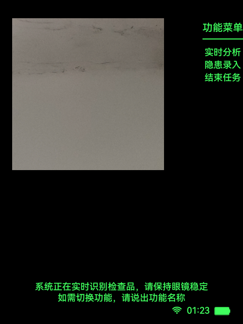
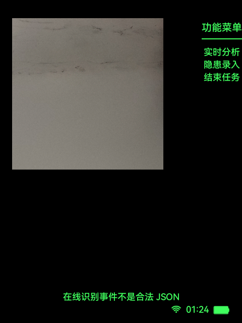

# 设备指引

关联总架构：[architecture.md](../architecture.md)

关联公共能力：

- [公共能力/隐患识别链路.md](../公共能力/隐患识别链路.md)
- [公共能力/统一输入.md](../公共能力/统一输入.md)

关联旅程图：[总体旅程图/设备指引旅程图.md](../总体旅程图/设备指引旅程图.md)

本文档是 `docs/功能模块/设备指引.md` 的单一正文真相源，收敛设备指引页的远端判定、确认语义、详情展示和跨功能跳转规则，并对齐当前代码与真机行为。

## 1. 功能目标

- 对当前视野中的检查品做远端判定。
- 在判定命中后，经用户确认再拉取检查重点详情。
- 支持从设备指引页跳回同级功能首页或进入统一结束页。

## 2. 功能边界

- 本模块负责：
  - `DeviceGuideActivity` 的检测态与结果态。
  - 远端判定接口与详情接口调用。
  - 检查品命中后的确认提示。
  - 跨功能语音跳转与结束任务。
- 本模块不负责：
  - 主菜单分发。
  - 任务关联链路。
  - 独立隐患录入保存逻辑。
- 本模块依赖：
  - [公共能力/会话与生命周期.md](../公共能力/会话与生命周期.md)
  - [公共能力/统一输入设计与接入.md](../公共能力/统一输入设计与接入.md)
  - `AiArSseService`
  - `InspectionCameraCoordinator`

## 3. 用户旅程 / 主流程

1. 用户从主菜单或同级功能页进入 `DeviceGuideActivity`。
2. 页面准备共享帧流并进入 `DETECTING`。
3. 检测态持续执行远端“是否存在检查品”判定。
4. 若返回命中，页面切到 `RESULT / PROMPT`，提示用户是否要提供检查重点。
5. 用户确认后，页面调用深度分析接口拉取检查重点文本。
6. 页面切到 `RESULT / DETAIL`，展示检查品说明和检查重点。
7. 用户返回时回到主菜单首页。
8. 用户也可以在检测态说“实时分析”“隐患录入”“结束任务”跳到对应功能。

## 4. 页面与状态总览

| 页面 | 状态 | 进入条件 | 退出条件 | 备注 |
| --- | --- | --- | --- | --- |
| `DeviceGuideActivity` | `DETECTING` | 页面创建或结果态返回检测 | 判定命中 / 语音跳转 / 返回菜单 / 结束任务 | 默认态 |
| `DeviceGuideActivity` | `RESULT / PROMPT` | 远端判定返回命中 | 确认拉详情 / 返回菜单 | 底部提示由弹窗承载 |
| `DeviceGuideActivity` | `RESULT / DETAIL` | 用户确认后详情拉取中或成功 | 返回菜单 | 展示卡片文本 |

## 5. 页面详情

## `DeviceGuideActivity`

### 页面职责

- 周期性抓取帧并调用远端判定。
- 在命中后请求用户确认。
- 拉取并展示检查重点详情。

### 进入条件

- 主菜单选择“设备指引”。
- 隐患识别或隐患录入语音跳转。

### 退出路径

- 返回 / 取消：回到 `AiInspectionMenuActivity`。
- 语音“实时分析”：进入 `AiInspectionActivity`。
- 语音“隐患录入”：进入 `HazardRecordActivity`。
- 语音“结束任务 / 结速任务”：进入 `InspectionEndReportActivity`。

### 页面状态

- `DETECTING`
- `RESULT / PROMPT`
- `RESULT / DETAIL`

### 关键 UI 元素

- 实时预览卡片。
- 检测态功能菜单。
- 命中弹窗 `statusAlertOverlay`。
- 结果缩略图。
- 文本滚动区。

### 可见性约束

- 仅 `DETECTING` 显示右上功能菜单。
- 结果态不显示功能菜单。
- `PROMPT` 通过 `statusAlertOverlay` 展示确认文案。
- `DETAIL` 显示结果文本和缩略图，不显示底部确认提示文案。

### 页面截图

#### `DETECTING`

- 对应状态：`DETECTING`
- 采集方式：真机从主菜单进入 `DeviceGuideActivity` 后截图
- 采集设备：`RG_glasses` 真机

#### `DETECTING / REMOTE_ERROR`

- 对应状态：`DETECTING` 下的远端异常提示
- 采集方式：真机检测态等待远端返回异常事件后截图
- 采集设备：`RG_glasses` 真机

#### `RESULT / PROMPT` 与 `RESULT / DETAIL`

- 本轮未保留 `RESULT / PROMPT`、`RESULT / DETAIL` 两个结果态的真机截图。
- 原因：当前现场未稳定命中“检查品识别成功 -> 确认 -> 详情返回”链路。
- 补采要求：必须分别补“命中待确认态”和“详情完成态”，不能用异常态代替。

## 6. 交互定义

### 触控指令

| 动作 | 触发器 | 生效页面态 | 注册位置 | 结果 |
| --- | --- | --- | --- | --- |
| `Confirm` | 单击 | `RESULT / PROMPT` | `DeviceGuideActivity.buildInputActions()` | 拉取详情 |
| `Cancel` | 返回、双击 | 全状态 | `DeviceGuideActivity.buildInputActions()` | 返回主菜单首页 |

### 语音指令

| 文本 | 拼音 | 动作 | 生效页面态 | 注册位置 |
| --- | --- | --- | --- | --- |
| `实时分析` | `shi shi fen xi` | 跳转隐患识别 | `DETECTING` | `DeviceGuideActivity.buildInputActions()` |
| `隐患录入` | `yin huan lu ru` | 跳转隐患录入 | `DETECTING` | `DeviceGuideActivity.buildInputActions()` |
| `结束任务` | `jie shu ren wu` | 结束任务 | 全状态 | `DeviceGuideActivity.buildInputActions()` |
| `结速任务` | `jie su ren wu` | 结束任务 | 全状态 | `DeviceGuideActivity.buildInputActions()` |
| `确认` | `que ren` | 确认 | `RESULT / PROMPT` | `DeviceGuideActivity.buildConfirmTriggers()` |
| `确定` | `que ding` | 确认 | `RESULT / PROMPT` | `DeviceGuideActivity.buildConfirmTriggers()` |
| `继续` | `ji xu` | 确认 | `RESULT / PROMPT` | `DeviceGuideActivity.buildConfirmTriggers()` |
| `取消` | `qu xiao` | 返回 | 全状态 | `DeviceGuideActivity.buildReturnTriggers()` |
| `返回` | `fan hui` | 返回 | 全状态 | `DeviceGuideActivity.buildReturnTriggers()` |

### 头部动作

- 当前未启用头部动作。
- 原因同上，统一输入层全局关闭。

## 7. 页面跳转与路由规则

| 来源页面 | 条件 / 动作 | 目标页面 | 失败 / 回退 |
| --- | --- | --- | --- |
| `AiInspectionMenuActivity` | 选择“设备指引”且已初始化 | `DeviceGuideActivity` | 无 |
| `InspectionLoadingActivity` | `EXTRA_NEXT_HOME_ACTIVITY = DeviceGuideActivity` | `DeviceGuideActivity` | 无 |
| `AiInspectionActivity` | 语音“设备指引” | `DeviceGuideActivity` | 无 |
| `HazardRecordActivity` | 语音“设备指引” | `DeviceGuideActivity` | 无 |
| `DeviceGuideActivity / DETECTING` | 语音“实时分析” | `AiInspectionActivity` | 无 |
| `DeviceGuideActivity / DETECTING` | 语音“隐患录入” | `HazardRecordActivity` | 无 |
| `DeviceGuideActivity / DETECTING or RESULT` | `Cancel` | `AiInspectionMenuActivity` | 无 |
| `DeviceGuideActivity / DETECTING or RESULT` | 语音“结束任务 / 结速任务” | `InspectionEndReportActivity` | 无 |

## 8. 后端与数据链路

## 链路 A：检查品判定

- 接口用途：判断当前画面是否存在需要提供检查重点的检查品。
- 触发时机：检测态轮询执行。
- 调用入口代码：
  - `DeviceGuideActivity.runDetectionLoop()`
  - `AiArSseService.identifyItemHazard(...)`
- 请求来源数据：`InspectionFrameCaptureService` 选出的 JPEG 帧。
- 关键请求字段：
   - 物品识别（`/ai/auto`）
  - `image`
- 关键响应字段：
  - `hasHazard`
  - `fullText`
- 成功后的页面 / 会话更新：
  - 若命中则进入 `RESULT / PROMPT`
  - 保存当前截图到 `currentPayload`
- 失败后的降级、回退、提示：
  - 留在 `DETECTING`
  - 更新底部提示为失败文案
- 日志锚点：
  - `device guide detect task rejected`

## 链路 B：检查重点详情

- 接口用途：在用户确认后拉取检查品说明和检查重点。
- 触发时机：`RESULT / PROMPT` 执行确认。
- 调用入口代码：
  - `DeviceGuideActivity.requestGuideDetails()`
  - `AiArSseService.requestDeepAnalysis(...)`
- 请求来源数据：
  - `currentPayload.jpegBytes`
- 关键请求字段：
  - 深度分析（`/ai/deep`）
  - `image`
- 关键响应字段：
  - 流式文本 chunks
  - 完整详情文本
- 成功后的页面 / 会话更新：
  - 解析为 `ResolvedHazardContent`
  - 页面切到 `RESULT / DETAIL`
  - 渲染检查品说明和检查重点
- 失败后的降级、回退、提示：
  - 回到 `DETECTING`
  - 底部提示详情失败
- 日志锚点：
  - `device_guide_detail_failed`

## 9. 会话与本地状态

- 当前模块不直接写 `InspectionWorkflowSession` 的业务结果。
- 页面内状态：
  - `pageState`
  - `resultStage`
  - `currentPayload`
  - `detectInFlight`
  - `detailInFlight`
- 相机与帧流：
  - `InspectionCameraCoordinator.acquire(owner = DEVICE_GUIDE, needPreview = true, ...)`

## 10. 代码真相源

- 页面真相源：
  - `app/src/main/java/com/rokid/glass/hiddenrisk/DeviceGuideActivity.kt`
- 输入真相源：
  - `DeviceGuideActivity.buildInputActions()`
  - `app/src/main/java/com/rokid/glass/input/UnifiedInput.kt`
- 接口真相源：
  - `app/src/main/java/com/rokid/glass/hiddenrisk/AiArSseService.kt`
- 会话真相源：
  - `InspectionEndReportReturnDestination`
- 配置真相源：
  - `InspectionConfigRepository.get().network.deviceGuideDetectApi`

## 11. 异常与降级分支

- 帧流不可用：
  - 保持检测态并提示 `device_guide_frame_stream_failed`
  - 开发检查 `InspectionCameraCoordinator`
- 判定接口失败：
  - 留在检测态
  - 开发检查 `identifyItemHazard(...)`
- 详情接口失败：
  - 回到检测态
  - 开发检查 `requestDeepAnalysis(...)`
- 在线事件格式异常：
  - 页面保持检测态，并可能出现“在线识别事件不是合法 JSON”提示。
  - 开发检查 `AiArSseService` 的事件解析日志与服务端 SSE 格式。
- 权限拒绝：
  - 页面无法进入稳定检测
  - 开发检查媒体权限申请结果

## 12. 开发检查清单

- [ ] 检测态持续轮询远端判定，结果态不继续显示功能菜单
- [ ] 命中后先显示确认提示，再拉取详情
- [ ] 语音“实时分析 / 隐患录入 / 结束任务”只进入目标功能首页
- [ ] 详情失败会回到检测态而不是停在半成品结果页
- [ ] 真机截图已覆盖检测态；提示态和详情态待现场补采
