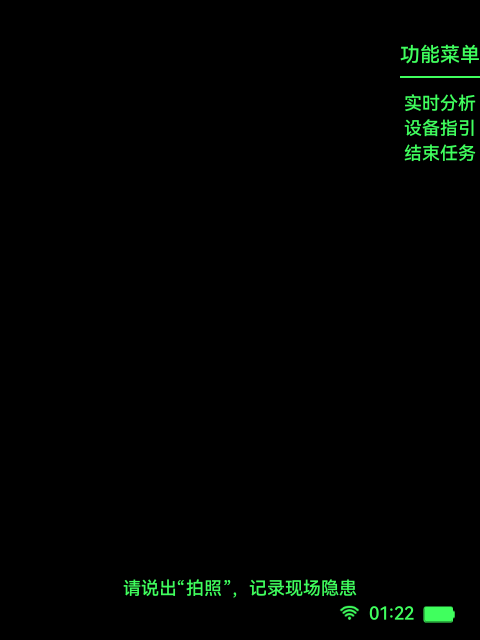
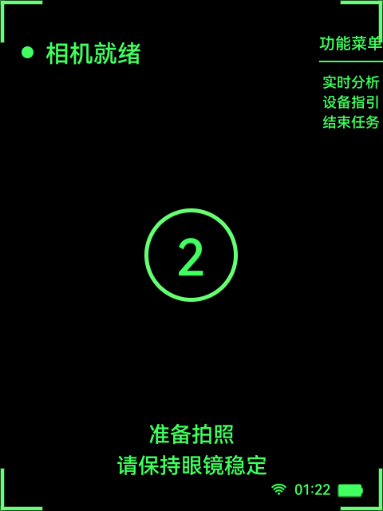
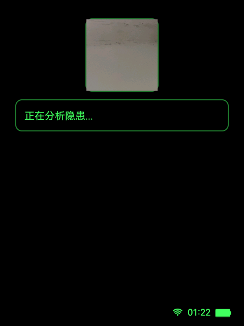

# 隐患录入

关联总架构：[architecture.md](../architecture.md)

关联公共能力：

- [公共能力/隐患识别链路.md](../公共能力/隐患识别链路.md)
- [公共能力/会话与生命周期.md](../公共能力/会话与生命周期.md)

关联旅程图：[总体旅程图/隐患录入旅程图.md](../总体旅程图/隐患录入旅程图.md)

本文档是 `docs/功能模块/隐患录入.md` 的单一正文真相源，收敛独立隐患录入页的页面状态、输入映射、上传链路和结束巡检关系，并对齐当前代码与真机行为。

## 1. 功能目标

- 支持用户在独立页面完成拍照、倒计时、实时分析、保存和结束任务。
- 把录入得到的截图、分析文本和保存结果写入 `InspectionWorkflowSession`，供结束巡检页汇总。

## 2. 功能边界

- 本模块负责：
  - `HazardRecordActivity` 的 `IDLE / COUNTDOWN / ANALYSIS` 三态。
  - 拍照截帧和在线深度分析。
  - 本地隐患上传。
  - 结束任务跳转到统一结束页。
- 本模块不负责：
  - AI 巡检自动识别轮询。
  - 企业二维码准备。
  - 结束页汇总展示逻辑本身。
- 本模块依赖：
  - [公共能力/会话与生命周期.md](../公共能力/会话与生命周期.md)
  - [公共能力/统一输入设计与接入.md](../公共能力/统一输入设计与接入.md)
  - `InspectionWorkflowSession`
  - `AiArSseService`
  - `LocalHazardPushService`

## 3. 用户旅程 / 主流程

1. 用户从主菜单进入 `HazardRecordActivity`。
2. 页面准备共享帧流并进入 `IDLE`。
3. 用户单击或说“拍照”后进入 `COUNTDOWN`。
4. 倒计时完成后，页面截取当前帧并调用在线深度分析。
5. 页面进入 `ANALYSIS`，展示缩略图和分析文本。
6. 用户确认时若文本还能翻页则先翻页；翻页结束后提交本地隐患上传。
7. 上传成功后返回 `IDLE` 并显示成功提示。
8. 用户在空闲态说“结束任务”或“结速任务”时进入统一结束页。

## 4. 页面与状态总览

| 页面 | 状态 | 进入条件 | 退出条件 | 备注 |
| --- | --- | --- | --- | --- |
| `HazardRecordActivity` | `IDLE` | 页面创建或上传成功返回 | 单击拍照 / 语音功能跳转 / 结束任务 / 退出 | 默认态 |
| `HazardRecordActivity` | `COUNTDOWN` | `IDLE` 触发拍照 | 倒计时结束进入分析 / 返回取消 | 倒计时态 |
| `HazardRecordActivity` | `ANALYSIS` | 已截帧并开始分析 | 保存成功返回 `IDLE` / 返回 `IDLE` | 结果态 |

## 5. 页面详情

## `HazardRecordActivity`

### 页面职责

- 准备共享帧流。
- 承载独立拍照与分析流程。
- 触发本地隐患上传，并把结果写入工作流会话。

### 进入条件

- 从 `AiInspectionMenuActivity` 直接进入。
- 或从 `DeviceGuideActivity` 语音跳转进入。

### 退出路径

- 空闲态返回 / 取消：结束当前页面。
- 语音“设备指引”：进入 `DeviceGuideActivity`。
- 语音“结束任务 / 结速任务”：进入 `InspectionEndReportActivity`。
- 分析态确认上传成功后回到空闲态。

### 页面状态

- `IDLE`
- `COUNTDOWN`
- `ANALYSIS`

### 关键 UI 元素

- 空闲态功能菜单。
- 倒计时数字。
- 分析态缩略图。
- 分析文本滚动区。
- 成功提示。

### 可见性约束

- `IDLE` 显示空闲态提示和功能菜单。
- `COUNTDOWN` 只显示倒计时与菜单。
- `ANALYSIS` 显示缩略图和分析内容。
- 分析进行中隐藏确认提示，完成后显示结果提示。

### 页面截图

#### `IDLE`

- 对应状态：`IDLE`
- 采集方式：真机从主菜单进入 `HazardRecordActivity` 后截图
- 采集设备：`RG_glasses` 真机

#### `COUNTDOWN`

- 对应状态：`COUNTDOWN`
- 采集方式：真机进入页面后触发一次单击拍照，在倒计时期间截图
- 采集设备：`RG_glasses` 真机

#### `ANALYSIS`

- 对应状态：`ANALYSIS`
- 采集方式：真机完成一次拍照并进入分析展示态后截图
- 采集设备：`RG_glasses` 真机

## 6. 交互定义

### 触控指令

| 动作 | 触发器 | 生效状态 | 注册位置 | 结果 |
| --- | --- | --- | --- | --- |
| `hazard_record_capture` | 单击 | `IDLE` | `HazardRecordActivity.buildInputActions()` | 进入倒计时 |
| `Confirm` | 单击 | `ANALYSIS` | `HazardRecordActivity.buildInputActions()` | 翻页或上传保存 |
| `Cancel` | 返回、双击 | `COUNTDOWN`、`ANALYSIS` | `HazardRecordActivity.buildInputActions()` | 返回 `IDLE` |
| `Exit` | 返回、双击 | `IDLE` | `HazardRecordActivity.buildInputActions()` | 结束当前页 |

### 语音指令

| 文本 | 拼音 | 动作 | 生效页面态 | 注册位置 |
| --- | --- | --- | --- | --- |
| `拍照` | `pai zhao` | 拍照倒计时 | `IDLE` | `HazardRecordActivity.buildInputActions()` |
| `实时分析` | `shi shi fen xi` | 实时分析 | `IDLE` | `HazardRecordActivity.buildInputActions()` |
| `设备指引` | `she bei zhi yin` | 跳转设备指引 | `IDLE` | `HazardRecordActivity.buildInputActions()` |
| `结束任务` | `jie shu ren wu` | 结束任务 | `IDLE` | `HazardRecordActivity.buildInputActions()` |
| `结速任务` | `jie su ren wu` | 结束任务 | `IDLE` | `HazardRecordActivity.buildInputActions()` |
| `确认` | `que ren` | 确认 | `ANALYSIS` | `HazardRecordActivity.buildConfirmTriggers()` |
| `确定` | `que ding` | 确认 | `ANALYSIS` | `HazardRecordActivity.buildConfirmTriggers()` |
| `返回` | `fan hui` | 返回 | `COUNTDOWN`、`ANALYSIS`、`IDLE` | `HazardRecordActivity.buildReturnTriggers()` |
| `取消` | `qu xiao` | 返回 | `COUNTDOWN`、`ANALYSIS`、`IDLE` | `HazardRecordActivity.buildReturnTriggers()` |

### 头部动作

- 当前未启用头部动作。
- 正式控制仅依赖触控和语音。

## 7. 页面跳转与路由规则

| 来源页面 | 条件 / 动作 | 目标页面 | 失败 / 回退 |
| --- | --- | --- | --- |
| `AiInspectionMenuActivity` | 选择“隐患录入” | `HazardRecordActivity` | 无 |
| `DeviceGuideActivity` | 语音“隐患录入” | `HazardRecordActivity` | 无 |
| `HazardRecordActivity / IDLE` | 语音“设备指引” | `DeviceGuideActivity` | 无 |
| `HazardRecordActivity / IDLE` | 语音“结束任务 / 结速任务” | `InspectionEndReportActivity` | 无 |
| `HazardRecordActivity / ANALYSIS` | `Confirm` 且翻页结束 | 保持当前页并执行上传 | 上传成功回 `IDLE`，失败留在 `ANALYSIS` |
| `HazardRecordActivity / ANALYSIS` | `Cancel` | `IDLE` | 无 |

## 8. 后端与数据链路

## 链路 A：在线深度分析

- 接口用途：对当前拍照帧做深度分析，生成隐患描述文本。
- 触发时机：倒计时结束或执行实时分析后。
- 调用入口代码：
  - `HazardRecordActivity.captureAndAnalyze()`
  - `HazardRecordActivity.beginAnalysis(...)`
  - `HazardRecordActivity.sendImageToAiAr(...)`
  - `AiArSseService.requestDeepAnalysis(...)`
- 请求来源数据：
  - `InspectionFrameCaptureService` 选出的 JPEG 帧。
- 关键请求字段：
  - `task_id`
  - `stream`
  - 深度分析（`/ai/deep`）
  - `image`
- 关键响应字段：
  - 流式文本 chunks
  - 完整分析文本
- 成功后的页面 / 会话更新：
  - 解析为 `ResolvedHazardContent`
  - `InspectionWorkflowSession.recordCapture(...)`
  - `InspectionWorkflowSession.recordDetection(...)`
  - `InspectionWorkflowSession.recordAnalysis(...)`
- 失败后的降级、回退、提示：
  - 保持在 `ANALYSIS`
  - 显示分析失败文案
- 日志锚点：
  - `record detail parse failed`

## 链路 B：本地隐患上传

- 接口用途：把拍照结果和解析出的隐患项上传到企业隐患接口。
- 触发时机：分析态 `Confirm` 且文本翻页结束。
- 调用入口代码：
  - `HazardRecordActivity.submitLocalHazard()`
  - `LocalHazardUploadItemBuilder.build(...)`
  - `LocalHazardPushService.pushLocalHazard(...)`
- 请求来源数据：
  - `enterpriseQrPayload.apiBaseUrl`
  - `enterpriseQrPayload.authCode`
  - `enterpriseQrPayload.objectId`
  - `enterpriseQrPayload.userId`
  - `enterpriseQrPayload.extraField`
  - 当前 JPEG
  - 当前解析出的隐患项
- 关键请求字段：
  - `hidDanger`
  - `jpegBytes`
  - 企业身份字段
- 关键响应字段：
  - 主备上传是否成功
- 成功后的页面 / 会话更新：
  - `InspectionWorkflowSession.recordSavedHazardAttempt(...)`
  - `InspectionWorkflowSession.updateSavedHazardAttemptOutcome(...SUCCESS)`
  - 返回 `IDLE`
- 失败后的降级、回退、提示：
  - `InspectionWorkflowSession.updateSavedHazardAttemptOutcome(...FAILED)`
  - 留在 `ANALYSIS` 并显示失败提示
- 日志锚点：
  - `pushLocalHazard start`
  - `pushLocalHazard primary success`
  - `pushLocalHazard final failed`

## 9. 会话与本地状态

- `InspectionWorkflowSession.latestCapturedJpeg`
  - 由 `recordCapture(...)` 写入。
- `InspectionWorkflowSession.latestDetectionTitle / latestAnalysisText`
  - 由分析成功后写入。
- `InspectionWorkflowSession.savedHazardRecordsByKey`
  - 由保存尝试和保存结果维护，供结束页汇总。
- 页面内状态：
  - `pageState`
  - `frameStreamReady`
  - `captureInProgress`
  - `streamingInProgress`
  - `saveSubmitting`

## 10. 代码真相源

- 页面真相源：
  - `app/src/main/java/com/rokid/glass/hiddenrisk/HazardRecordActivity.kt`
- 输入真相源：
  - `HazardRecordActivity.buildInputActions()`
  - `app/src/main/java/com/rokid/glass/input/UnifiedInput.kt`
- 接口真相源：
  - `app/src/main/java/com/rokid/glass/hiddenrisk/AiArSseService.kt`
  - `app/src/main/java/com/rokid/glass/hiddenrisk/LocalHazardPushService.kt`
- 会话真相源：
  - `app/src/main/java/com/rokid/glass/workflow/InspectionWorkflowSession.kt`
- 配置真相源：
  - `InspectionFrameCaptureService`
  - `LocalHazardUploadItemBuilder`

## 11. 异常与降级分支

- 权限缺失：
  - 页面提示相机或媒体权限不足。
  - 开发检查 `REQUEST_MEDIA_PERMISSION` 分支。
- 帧流准备失败：
  - `IDLE` 提示 `hazard_record_frame_stream_failed`。
  - 开发检查 `InspectionCameraCoordinator`。
- 在线分析失败：
  - 保持在 `ANALYSIS` 并显示失败文案。
  - 开发检查 `AiArSseService.requestDeepAnalysis()`。
- 上传字段缺失：
  - 页面直接提示缺少企业信息 / 图片 / 隐患项。
  - 不发请求。
- 上传失败：
  - 结果留在分析态。
  - 开发检查 `pushLocalHazard` 主备上传日志。

## 12. 开发检查清单

- [ ] `IDLE / COUNTDOWN / ANALYSIS` 三态切换与代码一致
- [ ] 空闲态“拍照 / 实时分析 / 设备指引 / 结束任务”语义正确
- [ ] 分析成功后写入了检测文本和截图到 `InspectionWorkflowSession`
- [ ] 上传成功和失败都会写回 `SavedHazardRecord` 状态
- [ ] 结束任务进入 `InspectionEndReportActivity`
- [ ] 真机截图覆盖空闲态、倒计时态和分析态
