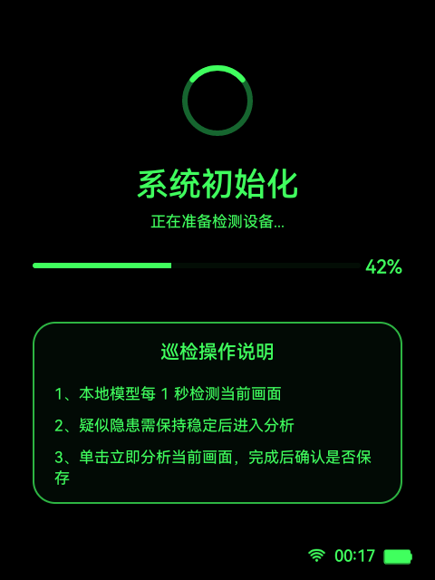
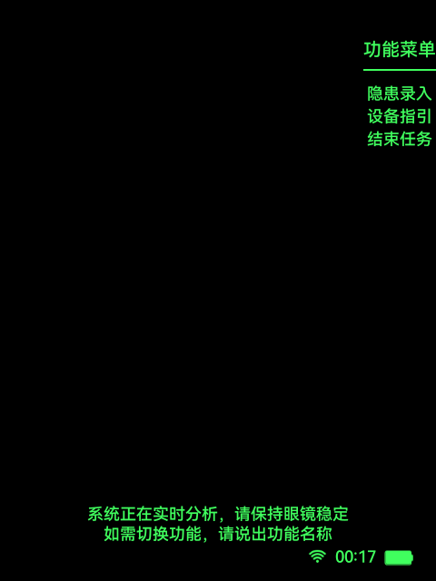
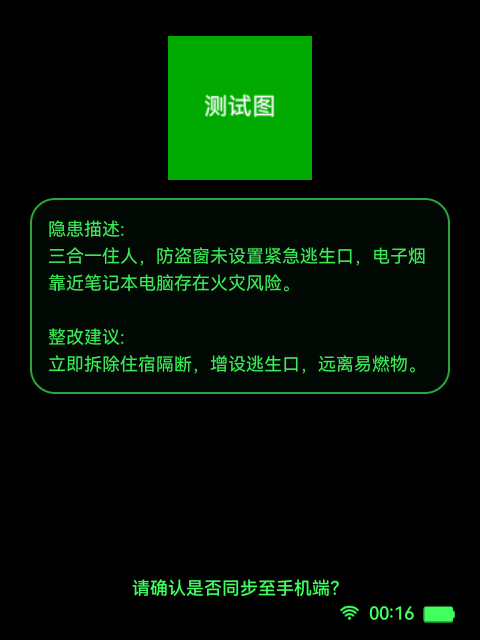
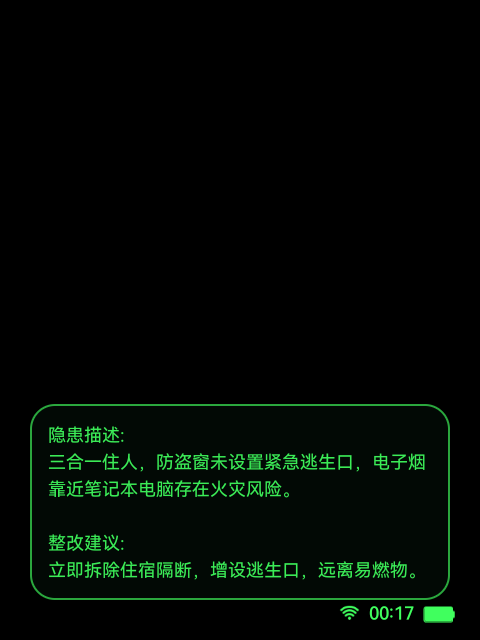

# 隐患识别

本文档是 `docs/功能模块/隐患识别.md` 的单一正文真相源，收敛原先拆散在 `功能说明`、`页面说明`、`页面跳转`、`用户旅程`、`代码索引` 中的信息，并补齐接口级实现细节、统一输入注册、会话状态和开发检查项。

## 1. 功能目标

- 完成从加载初始化、巡检检测、隐患结果展示、手机端同步确认到返回检测的完整隐患识别闭环。
- 在网络可用时优先走远端识别链路，在网络异常或连续失败达到阈值时，再按需加载本地 NCNN 作为备用链路。
- 把识别结果、截图、分析文本和同步结果写入巡检工作流会话，供结束巡检页和后续上传链路复用。

## 2. 功能边界

- 本模块负责：
  - 从主菜单点击“隐患分析”开始，到正式进入隐患识别主链为止的初始化衔接。
  - `InspectionLoadingActivity` 初始化与会话创建。
  - `AiInspectionActivity` 的检测态、结果态、自动链路切换、流式分析和手机端同步。
  - 本模块内与 `/ai/ar`、隐患同步接口相关的调用、失败降级和会话写入。
- 本模块不负责：
  - Wi-Fi 扫码与联网结果确认。
  - 企业二维码解析和企业对象信息展示。
  - 结束巡检页的最终汇总展示。
  - 设备指引、隐患录入页面的正文逻辑。
- 本模块依赖：
  - [公共能力/隐患识别链路.md](../公共能力/隐患识别链路.md)
  - [公共能力/统一输入设计与接入.md](../公共能力/统一输入设计与接入.md)
  - [公共能力/隐患识别验证与排障.md](../公共能力/隐患识别验证与排障.md)
  - `InspectionSession`
  - `InspectionWorkflowSession`
  - `InspectionConfigRepository`

## 3. 用户旅程 / 主流程

1. 用户在主菜单点击“隐患分析”。
2. 若 `InspectionSession` 已初始化，则直接进入 `AiInspectionActivity`；否则先进入 `InspectionLoadingActivity`。
3. `InspectionLoadingActivity` 完成 SDK 初始化、相机帧流准备，并创建新的巡检 `sessionId`。
4. `AiInspectionActivity` 进入 `DETECTING` 检测态，自动巡检持续运行；用户也可以手动触发“分析”。
5. 自动在线链路至少运行物品识别 lane；若配置启用场景识别 lane，则两条 lane 竞争执行，任一路返回“是”即停止在线检测并进入详情链路。
6. 自动在线链路或本地备用链路命中隐患后，页面切到 `STREAM_RESPONSE` 结果态，先展示描述页。
7. 用户在描述页确认后，先触发手机端同步，再进入整改建议页。
8. 用户在整改建议页确认或取消后，返回检测态继续巡检。
9. 用户在检测态说“结束任务”或“结速任务”时，跳转到结束巡检页。

## 4. 页面与状态总览

| 页面 | 状态 | 进入条件 | 退出条件 | 备注 |
| --- | --- | --- | --- | --- |
| `InspectionLoadingActivity` | `IDLE` | Activity 创建 | 开始初始化 | 初始 UI 状态 |
| `InspectionLoadingActivity` | `SDK_INIT` | 调 `RokidSdkManager.ensureInitialized()` | SDK 成功或失败 | 依赖 Rokid SDK 状态 |
| `InspectionLoadingActivity` | `CAMERA_INIT` | SDK 就绪后开始准备共享帧流 | 相机帧流成功或失败 | 由 `InspectionSession.initFrameStream()` 驱动 |
| `InspectionLoadingActivity` | `COMPLETE` | 初始化完成 | 交还给隐患识别主链下一页 | 先 `InspectionSession.markInitialized()` 再导航 |
| `InspectionLoadingActivity` | `ERROR` | SDK 或相机初始化失败 | 点击重试或退出 | Retry 仅在错误态启用 |
| `AiInspectionActivity` | `DETECTING` | 初始化完成且会话可用 | 手动分析、自动命中隐患、结束巡检、跨功能跳转 | 右上功能菜单可见 |
| `AiInspectionActivity` | `STREAM_RESPONSE / DESCRIPTION` | 自动隐患结果或手动分析进入结果态 | 确认触发同步并进入建议页，取消返回检测态 | 结果态隐藏功能菜单 |
| `AiInspectionActivity` | `STREAM_RESPONSE / ADVICE` | 同步成功后进入整改建议页 | 确认或取消都返回检测态 | 建议页底部确认提示隐藏，卡片做入场动画 |

## 5. 页面详情

## `InspectionLoadingActivity`

### 页面职责

- 初始化 Rokid SDK。
- 准备共享相机帧流。
- 标记 `InspectionSession` 已初始化。
- 创建新的巡检 `sessionId`，并把会话切到可进入正式巡检的状态。

### 进入条件

- 从 `AiInspectionMenuActivity` 点击“隐患分析”进入。
- 或从未初始化的 `AiInspectionActivity` 回退进入。

### 退出路径

- 初始化完成后，交还给隐患识别主链下一页。
- 若宿主主链仍要求先补齐扫码或企业上下文，由外部模块接管，本文不展开。
- 失败态点击重试：重新开始初始化。
- 返回 / 双击 / 语音“退出”：直接结束当前页。

### 页面状态

- `IDLE`
- `SDK_INIT`
- `CAMERA_INIT`
- `COMPLETE`
- `ERROR`

### 关键 UI 元素

- 加载环、进度条、百分比。
- 巡检操作说明卡片。
- 错误态提示区。
- 底部状态栏。

### 可见性约束

- 错误态才启用 `loading_retry`。
- `debug_snapshot=true` 时不执行真实初始化逻辑，只渲染静态加载态，便于截图和 UI 验证。

### 页面截图

### 截图说明

- 对应状态：`InspectionLoadingActivity` 静态加载态。
- 采集方式：`adb shell am start -S -n com.rokid.glesse/com.rokid.glass.hiddenrisk.InspectionLoadingActivity --ez debug_snapshot true --ei debug_progress 42` 后执行 `screencap`。
- 采集设备：`RG_glasses` 真机，分辨率 `480 x 640`。

## `AiInspectionActivity`

### 页面职责

- 承载正式 AI 巡检主界面。
- 管理自动远端识别、本地备用识别、手动流式分析和结果展示。
- 负责描述页确认后的手机端同步，以及建议页展示。
- 负责跨功能跳转和结束巡检入口。

### 进入条件

- `InspectionSession.isInitialized == true`。
- 未初始化时，页面立即回退到 `InspectionLoadingActivity`。

### 退出路径

- 检测态“返回 / 取消”进入 `AiInspectionMenuActivity`。
- 检测态“设备指引”进入 `DeviceGuideActivity`。
- 检测态“隐患录入”进入 `HazardRecordActivity`。
- 检测态“结束任务 / 结速任务”进入 `InspectionEndReportActivity`。
- 结果态确认或取消最终都回到 `DETECTING`。

### 页面状态

- `DETECTING`
- `STREAM_RESPONSE`
  - `DESCRIPTION`
  - `ADVICE`

### 关键 UI 元素

- 实时取景预览。
- 检测态底部提示文案。
- 右上功能菜单。
- 结果态缩略图卡片。
- 结果态文本滚动区。
- 结果态底部确认提示。
- `statusAlertOverlay` 常驻告警叠层。

### 可见性约束

- 检测态显示右上功能菜单。
- `STREAM_RESPONSE` 结果态始终隐藏右上功能菜单。
- 结果态进入后隐藏 `statusAlertOverlay`。
- `DESCRIPTION` 页显示底部确认提示。
- `ADVICE` 页隐藏底部确认提示，并执行建议卡片入场动画。

### 在线结果展示与保存上传

- 自动在线详情到达展示窗口且收到首个有效 chunk 后，进入 `STREAM_RESPONSE / DESCRIPTION` 并增量渲染原始文字流。
- 在线 description 页保留原始文字流，避免流结束后再被结构化文案替换；保存 / 上传链路继续使用解析后的 `ResolvedHazardContent`。
- `ResolvedHazardContent` 进入本地上传前，由 `LocalHazardUploadItemBuilder` 组装上传项：跳过空 `hidNum`，跳过 `hidLevel = 2` 的重大隐患，按 `hidNum` 去重，重复时保留首条。

### 页面截图

#### `DETECTING`

- 对应状态：`DETECTING`
- 采集方式：`adb shell am start -S -n com.rokid.glesse/com.rokid.glass.hiddenrisk.AiInspectionActivity --es debug_state analyzing`

#### `STREAM_RESPONSE / DESCRIPTION`

- 对应状态：`STREAM_RESPONSE / DESCRIPTION`
- 采集方式：`adb shell am start -S -n com.rokid.glesse/com.rokid.glass.hiddenrisk.AiInspectionActivity --es debug_state result`

#### `STREAM_RESPONSE / ADVICE`

- 对应状态：`STREAM_RESPONSE / ADVICE`
- 采集方式：`adb shell am start -S -n com.rokid.glesse/com.rokid.glass.hiddenrisk.AiInspectionActivity --es debug_state sync`

## 6. 交互定义

## `InspectionLoadingActivity`

### 触控指令

| 动作 | 触发器 | 生效状态 | 注册位置 | 结果 |
| --- | --- | --- | --- | --- |
| `loading_retry` | 单击 | `ERROR` | `InspectionLoadingActivity.buildInputActions()` | 重试初始化 |
| `Exit` | 返回、双击 | 全状态 | `InspectionLoadingActivity.buildInputActions()` | 退出当前页 |

### 语音指令

| 文本 | 拼音 | 动作 | 生效状态 | 注册位置 |
| --- | --- | --- | --- | --- |
| `退出` | `tui chu` | `Exit` | 全状态 | `InspectionLoadingActivity.voiceTrigger()` |

### 头部动作

- 当前未注册。
- 原因：`UnifiedInputSession` 全局常量 `HEAD_GESTURE_LISTENING_ENABLED = false`。

## `AiInspectionActivity`

### 检测态触控指令

| 动作 | 触发器 | 生效页面态 | 结果 |
| --- | --- | --- | --- |
| `ai_detecting_stream_analysis` | 单击 | `DETECTING` 且无待展示隐患 | 停止自动巡检，重新抓当前帧并发起手动流式分析 |
| `ai_detecting_back_to_menu` | 返回、双击 | `DETECTING` 且无待展示隐患 | 取消当前链路并返回 `AiInspectionMenuActivity` |

### 检测态语音指令

| 文本 | 拼音 | 动作 | 生效页面态 | 结果 |
| --- | --- | --- | --- | --- |
| `分析` | `fen xi` | `ai_detecting_stream_analysis` | `DETECTING` | 发起手动流式分析 |
| `深度分析` | `shen du fen xi` | `ai_detecting_stream_analysis` | `DETECTING` | 发起手动流式分析 |
| `返回` | `fan hui` | `ai_detecting_back_to_menu` | `DETECTING` | 返回 `AiInspectionMenuActivity` |
| `取消` | `qu xiao` | `ai_detecting_back_to_menu` | `DETECTING` | 返回 `AiInspectionMenuActivity` |
| `结束任务` | `jie shu ren wu` | `ai_detecting_finish` | `DETECTING` | 进入结束巡检页 |
| `结速任务` | `jie su ren wu` | `ai_detecting_finish` | `DETECTING` | 进入结束巡检页 |
| `设备指引` | `she bei zhi yin` | `ai_detecting_device_guide` | `DETECTING` | 跳转 `DeviceGuideActivity` |
| `隐患录入` | `yin huan lu ru` | `ai_detecting_hazard_record` | `DETECTING` | 跳转 `HazardRecordActivity` |

### 结果态触控 / 语音指令

| 页面态 | 动作 | 触发器 | 结果 |
| --- | --- | --- | --- |
| `STREAM_RESPONSE / NONE` | `Confirm` | 单击、`确认`、`确定`、`继续` | 直接回到检测态 |
| `STREAM_RESPONSE / DESCRIPTION` | `Confirm` | 单击、`确认`、`确定`、`继续` | 若当前页还能翻页则先翻页；否则触发本地隐患同步并进入建议页 |
| `STREAM_RESPONSE / ADVICE` | `Confirm` | 单击、`确认`、`确定`、`继续` | 若当前页还能翻页则先翻页；否则回到检测态 |
| `STREAM_RESPONSE / NONE` | `Cancel` | 返回、双击、`返回`、`取消` | 回到检测态 |
| `STREAM_RESPONSE / DESCRIPTION` | `Cancel` | 返回、双击、`返回`、`取消` | 回到检测态 |
| `STREAM_RESPONSE / ADVICE` | `Cancel` | 返回、双击、`返回`、`取消` | 回到检测态 |

### 头部动作

- 当前未注册。
- 原因同上，统一输入层已全局关闭头部动作监听。

## 7. 页面跳转与路由规则

| 来源页面 | 条件 / 动作 | 目标页面 | 失败 / 回退 |
| --- | --- | --- | --- |
| `AiInspectionMenuActivity` | 点击“隐患分析”且 `InspectionSession.isInitialized == true` | `AiInspectionActivity` | 无 |
| `AiInspectionMenuActivity` | 点击“隐患分析”且 `InspectionSession.isInitialized == false` | `InspectionLoadingActivity` | 初始化失败留在本页 `ERROR` |
| `AiInspectionActivity` | `InspectionSession.isInitialized == false` | `InspectionLoadingActivity` | 无 |
| `AiInspectionActivity / DETECTING` | `返回` / `取消` | `AiInspectionMenuActivity` | 无 |
| `AiInspectionActivity / DETECTING` | `设备指引` | `DeviceGuideActivity` | 无 |
| `AiInspectionActivity / DETECTING` | `隐患录入` | `HazardRecordActivity` | 无 |
| `AiInspectionActivity / DETECTING` | 语音“结束任务 / 结速任务” | `InspectionEndReportActivity` | 无 |
| `AiInspectionActivity / DETECTING` | 自动在线命中隐患 | `STREAM_RESPONSE / DESCRIPTION` | 详情失败回到检测态 |
| `AiInspectionActivity / DETECTING` | 本地备用链路命中隐患 | `STREAM_RESPONSE / DESCRIPTION` | 构造结果失败则继续检测 |
| `AiInspectionActivity / DESCRIPTION` | `Confirm` 且文本翻页结束 | `STREAM_RESPONSE / ADVICE` | 同步失败留在描述页并显示错误文案 |
| `AiInspectionActivity / DESCRIPTION` | `Cancel` | `DETECTING` | 无 |
| `AiInspectionActivity / ADVICE` | `Confirm` / `Cancel` | `DETECTING` | 在线建议失败退回描述页 |

## 8. 后端与数据链路

## 链路 A：自动在线隐患检测

- 接口用途：判断当前画面是否“存在隐患”。
- 调用入口：
  - `AiInspectionActivity`
  - `OnlineHazardDetectionService.submitDetection()`
  - 物品识别 lane：`AiArSseService.identifyItemHazard()`
  - 场景识别 lane：`AiArSseService.identifySceneHazard()`，受 `enableOnlineSceneHazardDetection` 控制
- 接口地址来源：`InspectionConfigRepository.get().network.aiArApi.url`
- 默认地址：`http://183.147.142.133:50011/ai/ar`
- 请求协议：
  - SSE `POST`
  - `Accept: text/event-stream`
  - 物品识别：`ctype = 1`
  - 场景识别：`ctype = 2`
- 请求体字段：
  - `task_id`
  - `stream`
  - `ctype`
  - `image`，当前帧 JPEG 的 Base64
- lane 节拍：
  - 物品识别：`onlineDetectIntervalMs`，默认 `1000ms`
  - 场景识别：`onlineSceneDetectIntervalMs`，默认 `3000ms`
- 触发时机：
  - 检测态自动巡检周期触发。
  - 每条 lane 内仅允许单飞，超时时间由 `network.aiArApi.detectTimeoutMs` 控制。
  - 物品识别 lane 必跑；场景识别 lane 仅在 `enableOnlineSceneHazardDetection = true` 时启动，当前基础配置默认关闭。
  - 已启动的在线 lane 都独立截取最新帧，不等待或复用本地 NCNN shared frame。
- 成功后：
  - `OnlineHazardDetectionService` 回调 `onDetectionResult(...)`
  - `AiInspectionActivity.handleAutoDetectedOnlineHazardResult(...)`
  - 启用场景识别时，任一路返回“是”即标记本轮已决出赢家，取消两条 lane 的在途检测并停止两个循环。
  - 未启用场景识别时，仅物品识别 lane 参与自动在线检测。
  - 若路由仍为 `ONLINE`，复用赢家 JPEG 继续请求详情并准备结果展示。
  - 若路由切到 `LOCAL`，构造最小本地结果页。
- 失败后：
  - 任一路失败、超时或丢弃都按请求累计远端失败次数。
  - 低于阈值时继续保持 `REMOTE_PRIMARY`
  - 连续失败达到 `remoteFailureFallbackThreshold` 后切到 `LOCAL_FALLBACK_LOADING`
  - 等本地模型加载成功后进入 `LOCAL_FALLBACK`
- SSE 兼容：
  - 普通业务事件仍按 JSON object 解析 `task_id` 与 `content`。
  - 结束事件兼容 `data=[DONE]`、`type=done data=["DONE"]`、`type=done data=""`，命中后只结束聚合，不当作业务 JSON 解析。
- 关键日志锚点：
  - `post online inference loop lane=item`
  - `post online inference loop lane=scene`
  - `selected online frame lane=item`
  - `selected online frame lane=scene`
  - `openStream requestStart ctype=1`
  - `openStream requestStart ctype=2`
  - `openStream received done sentinel`
  - `detect success lane=...`
  - `detect failure lane=...`
  - `detect timeout`

## 链路 B：在线详情 / 手动分析 / 在线建议

- 接口用途：
  - 手动分析当前画面详情
  - 自动在线隐患命中后的详情补全
  - 在线整改建议生成
- 调用入口：
  - 手动分析：`AiInspectionActivity.requestStreamingAnalysis()` -> `sendImageToAiAr()` -> `AiArSseService.requestDeepAnalysis()`
  - 自动详情：`OnlineHazardDetectionService.requestDeepAnalysis()` -> `AiArSseService.requestDeepAnalysis()`
  - 在线建议：`AiInspectionActivity.requestOnlineHazardAdvice()` -> `AiArSseService.fetchInspectionGuide()`
- 接口地址来源：
  - 手动分析 / 自动详情：`network.aiArApi.url`
  - 在线建议：同样走 `AiArSseService`，但 `ctype = 3`
- 请求协议：
  - `ctype = 0`：对图像做深度分析
  - `ctype = 3`：根据描述文本生成设备巡检建议
- 请求体字段：
  - 深度分析：`task_id`、`stream`、`ctype`、`image`
  - 在线建议：`task_id`、`stream`、`ctype`、`text`
- 成功后：
  - 深度分析结果统一经 `AiArHazardDetailParser.parse(...)` 转成 `ResolvedHazardContent`
  - 自动在线详情到达展示窗口且已收到首个有效 chunk 后，进入 `STREAM_RESPONSE / DESCRIPTION` 并增量渲染原始文字流。
  - 在线 description 页保留原始文字流，避免流结束后再被结构化文案替换；保存 / 上传链路继续使用解析后的 `ResolvedHazardContent`。
  - 描述页写入：
    - `InspectionWorkflowSession.recordCapture(...)`
    - `InspectionWorkflowSession.recordDetection(...)`
    - `InspectionWorkflowSession.recordAnalysis(...)`
  - 在线建议成功后，用建议文案覆盖结果区，并再次 `recordAnalysis(...)`
- 失败后：
  - 手动分析失败：`handleSSEError(...)`
  - 自动详情失败：返回检测态并弹 toast
  - 在线建议失败：退回描述页，保留已有描述并弹 toast
- 关键日志锚点：
  - `openStream requestStart`
  - `manual ai/ar opened`
  - `manual ai/ar closed`
  - `inspection guide opened`
  - `inspection guide failed`
  - `handle_online_detail_success`

## 链路 C：手机端同步 / 本地隐患保存

- 接口用途：把当前隐患描述、整改建议和截图同步到企业端 / 手机端。
- 调用入口：
  - `AiInspectionActivity.submitLocalHazardAndShowAdvice()`
  - `LocalHazardPushService.pushLocalHazard()`
- 接口地址来源：
  - 主接口：`enterpriseQrPayload.apiBaseUrl`
  - 备接口：`InspectionConfigRepository.get().network.saveResultApi.backupBaseUrl`
- 主备端点：
  - 主接口：`<baseUrl>/smartGlasses/pushHidDanger` 或 `<baseUrl>/pushHidDanger`
  - 备接口：`http://183.147.142.133:7443/hxy/apis/hazardCheckRecord/saveHazard`
- 请求体字段：
  - `authCode`
  - `objectId`
  - `userId`
  - `customParam`
  - `image`
  - `hidDanger[]`
    - `indexNum`
    - `descrip`
    - `advice`
    - `hidNum`
    - `hidLevel`
    - `lawBasis`
- 请求来源数据：
  - 企业上下文：`InspectionWorkflowSession.enterpriseQrPayload`
  - 隐患信息：`ResolvedHazardContent` -> `LocalHazardUploadItemBuilder`
    - 跳过空隐患编号。
    - 跳过隐患等级为 `2` 的重大隐患。
    - 按隐患编号去重，重复时保留首条。
  - 截图：当前结果页 `jpegBytes`
- 成功后：
  - `InspectionWorkflowSession.updateSavedHazardAttemptOutcome(..., SUCCESS)`
  - 标记 `pendingUploadSuccessToast = true`
  - 进入建议页
- 失败后：
  - `InspectionWorkflowSession.updateSavedHazardAttemptOutcome(..., FAILED)`
  - 停留在描述页
  - 底部提示区显示错误文案
- 关键日志锚点：
  - `pushLocalHazard start`
  - `pushLocalHazard attemptStart`
  - `pushLocalHazard response`
  - `pushLocalHazard final failed`
  - `local save failed`

## 9. 会话与本地状态

## `InspectionSession`

- 职责：持有当前进程内复用的 NCNN 模型与共享帧流状态。
- 关键字段：
  - `hiddenRiskNcnn`
  - `isFrameStreamReady`
  - `isModelLoaded`
  - `isInitialized`
  - `errorMessage`
- 关键行为：
  - `createNcnnInstance()`
  - `loadModel(...)`
  - `initFrameStream(...)`
  - `markInitialized()`
  - `reset()`
  - `release()`

## `InspectionWorkflowSession`

- 职责：保存跨页面的巡检业务上下文。
- 本模块重点读写字段：
  - `workflowMode`
  - `enterpriseQrPayload`
  - `inspectionSessionId`
  - `latestAnalysisSessionId`
  - `latestDetectionTitle`
  - `latestDetectionMessage`
  - `latestAnalysisText`
  - `latestCapturedJpeg`
  - `savedHazardRecordsByKey`
  - `summary`
- 本模块重点调用：
  - `beginInspection(...)`
  - `updateMode(...)`
  - `recordCapture(...)`
  - `recordDetection(...)`
  - `recordAnalysis(...)`
  - `recordSavedHazardAttempt(...)`
  - `updateSavedHazardAttemptOutcome(...)`

## 页面内临时状态

- `pageState`
- `localResultStage`
- `autoPipelineMode`
- `pendingAutoHazardPresentation`
- `streamingInProgress`
- `localSaveSubmitting`
- `pendingStreamStart`
- `itemOnlineLaneRuntime`
- `sceneOnlineLaneRuntime`
- `onlineRequestIdSequence`
- `sessionId`

## 配置项来源

- `InspectionConfigRepository.get().aiInspection`
  - `remoteFailureFallbackThreshold`
  - `localNetworkProbeIntervalMs`
  - `enableOnlineSceneHazardDetection`
  - `enableOnlineAdvicePage`
  - `streamThumbnailTargetPx`
  - `targetInputSize`
  - `backend`
  - `gpuProfile`
- `InspectionConfigRepository.get().network`
  - `aiArApi`
  - `saveResultApi`

## 10. 代码真相源

- 页面真相源：
  - `app/src/main/java/com/rokid/glass/hiddenrisk/InspectionLoadingActivity.kt`
  - `app/src/main/java/com/rokid/glass/hiddenrisk/AiInspectionActivity.kt`
- 输入真相源：
  - `app/src/main/java/com/rokid/glass/input/UnifiedInput.kt`
  - `InspectionLoadingActivity.buildInputActions()`
  - `AiInspectionActivity.buildInputActions()`
- 自动链路真相源：
  - `app/src/main/java/com/rokid/glass/hiddenrisk/AutoHazardPipelineDecider.kt`
  - `AiInspectionActivity.applyPipelineDecision(...)`
  - `app/src/main/java/com/rokid/glass/hiddenrisk/OnlineHazardCompetitionDecider.kt`
- 接口真相源：
  - `app/src/main/java/com/rokid/glass/hiddenrisk/AiArSseService.kt`
  - `app/src/main/java/com/rokid/glass/hiddenrisk/OnlineHazardDetectionService.kt`
  - `app/src/main/java/com/rokid/glass/hiddenrisk/LocalHazardPushService.kt`
- 会话真相源：
  - `app/src/main/java/com/rokid/glass/hiddenrisk/InspectionSession.kt`
  - `app/src/main/java/com/rokid/glass/workflow/InspectionWorkflowSession.kt`
- 配置真相源：
  - `app/src/main/java/com/rokid/glass/config/InspectionAppConfig.kt`
  - `app/src/main/java/com/rokid/glass/config/InspectionConfigRepository.kt`

## 11. 异常与降级分支

## 初始化失败

- 触发点：
  - SDK 初始化失败
  - 共享帧流初始化失败
- 页面表现：
  - `InspectionLoadingActivity` 停在 `ERROR`
  - Retry 动作启用
- 开发检查：
  - `RokidSdkManager` 状态变化日志
  - `InspectionSession.errorMessage`
  - 帧流 ready / warm 日志

## 会话未初始化

- 触发点：`AiInspectionActivity` 打开时 `InspectionSession.isInitialized == false`
- 页面表现：
  - 立即跳回 `InspectionLoadingActivity`
- 开发检查：
  - `InspectionSession 未初始化，返回加载页面`

## 在线检测失败

- 触发点：
  - `/ai/ar` 返回错误
  - SSE 中断
  - 请求超时
- 页面表现：
  - 未达到阈值：继续远端主链路
  - 达到阈值：切到本地 fallback 加载 / 本地 fallback
- 开发检查：
  - `detect failure`
  - `detect timeout`
  - `AutoHazardPipelineDecider.decideAfterRemoteFailure(...)`

## 在线详情 / 在线建议失败

- 页面表现：
  - 自动详情失败：直接回到检测态并提示失败 toast
  - 在线建议失败：退回描述页并保留已有描述
- 开发检查：
  - `online detail failed`
  - `inspection guide failed`

## 手机端同步失败

- 页面表现：
  - 留在描述页
  - 底部提示区显示错误消息
  - 不进入建议页
- 开发检查：
  - `pushLocalHazard final failed`
  - `local save failed`
  - `InspectionWorkflowSession.SaveOutcome.FAILED`

## 资源未就绪

- 触发点：
  - JPEG 为空
  - `enterpriseQrPayload` 缺失
  - 上传字段缺失
- 页面表现：
  - 直接提示“缺少企业巡检信息 / 缺少上传地址 / 隐患图片缺失”等错误
- 开发检查：
  - `submitLocalHazardAndShowAdvice()` 的前置校验分支

## 12. 开发检查清单

- [ ] `InspectionLoadingActivity` 初始化完成后，是否先 `InspectionSession.markInitialized()` 再导航。
- [ ] 从菜单进入时，已初始化是否直进 `AiInspectionActivity`，未初始化是否进入 `InspectionLoadingActivity`。
- [ ] `AiInspectionActivity` 未初始化回退逻辑是否仍然存在且可触发。
- [ ] 检测态是否只在 `pageState == DETECTING` 时显示右上功能菜单。
- [ ] 结果态是否始终隐藏右上功能菜单，并在进入结果态时隐藏 `statusAlertOverlay`。
- [ ] `UnifiedInputSession` 是否仍按页面态动态注册 / 注销动作。
- [ ] 所有语音指令是否记录了文本、拼音、注册位置和生效页面态。
- [ ] `HEAD_GESTURE_LISTENING_ENABLED` 当前是否仍为关闭，文档与代码是否一致。
- [ ] 自动在线物品识别是否仍为 `ctype = 1` 且必跑，场景识别是否仍为 `ctype = 2` 且受 `enableOnlineSceneHazardDetection` 控制。
- [ ] 物品识别是否按 `onlineDetectIntervalMs` 触发；场景识别启用时是否按 `onlineSceneDetectIntervalMs` 触发。
- [ ] 启用场景识别时，任一路返回“是”后，是否停止双 lane 循环并取消另一条在途检测。
- [ ] 在线检测 lane 是否都直接 fresh capture，而不是等待本地 NCNN shared frame。
- [ ] 在线 description 页是否保留原始文字流，保存 / 上传链路是否仍使用解析后的结构化内容。
- [ ] 本地隐患上传项是否跳过空隐患编号、跳过重大隐患等级 `2`，并按隐患编号去重。
- [ ] SSE done 事件是否兼容 `data=[DONE]` 和 `type=done data=["DONE"]`，且不再误报“在线识别事件不是合法 JSON”。
- [ ] 手动分析 / 自动详情请求是否仍为 `ctype = 0`，在线建议是否仍为 `ctype = 3`。
- [ ] `/ai/ar` 地址、超时和 `saveResultApi` 配置是否仍来自 `InspectionConfigRepository`。
- [ ] 本地隐患同步时，主备端点是否并行发送且两个端点都完成后才汇总结果。
- [ ] 描述页确认后是否先做同步，再进入建议页。
- [ ] 同步失败时是否留在描述页，并把错误写到底部提示区。
- [ ] `InspectionWorkflowSession` 是否在描述页写入 capture、detection、analysis，在同步结果回调里写入 save outcome。
- [ ] 真机回归时，至少验证 `loading / detecting / description / advice` 四个截图态与本文档一致。
- [ ] 真机回归时，至少验证一次远端主链路成功、一次远端失败转本地 fallback、一次同步成功、一次同步失败。
