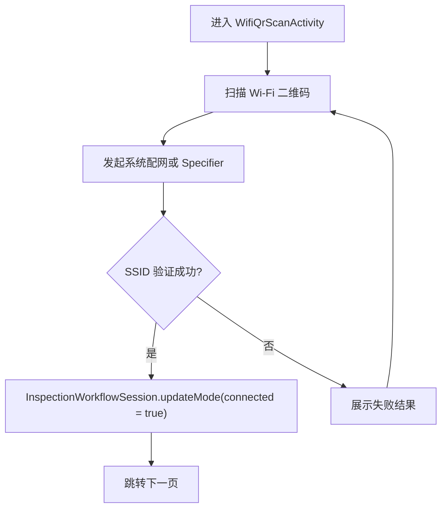

# WiFi连接旅程图

关联总架构：[architecture.md](../architecture.md)

关联模块：[功能模块/WiFi连接.md](../功能模块/WiFi连接.md)

```mermaid
flowchart TD
    A["进入 WifiQrScanActivity"] --> B["扫描 Wi-Fi 二维码"]
    B --> C["发起系统配网或 Specifier"]
    C --> D{"SSID 验证成功?"}
    D -- 是 --> E["InspectionWorkflowSession.updateMode(connected = true)"]
    E --> F["跳转下一页"]
    D -- 否 --> G["展示失败结果"]
    G --> B
```

对应功能正文见 [功能模块/WiFi连接.md](C:\Users\wuchaoli\Desktop\codespace\glassdemo\docs\功能模块\WiFi连接.md)。
