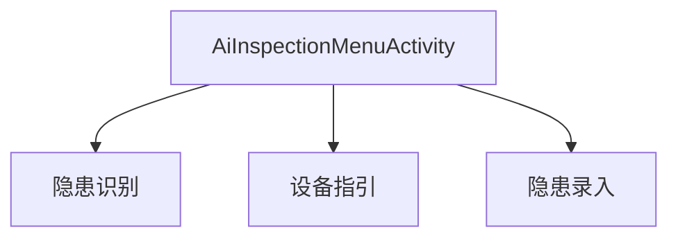

# 主菜单旅程图

```mermaid
flowchart TD
    A["AiInspectionMenuActivity"] --> B["隐患识别"]
    A --> C["设备指引"]
    A --> D["隐患录入"]
```

对应功能正文见 [主菜单/用户旅程.md](C:\Users\wuchaoli\Desktop\codespace\glassdemo\docs\主菜单\用户旅程.md)。
