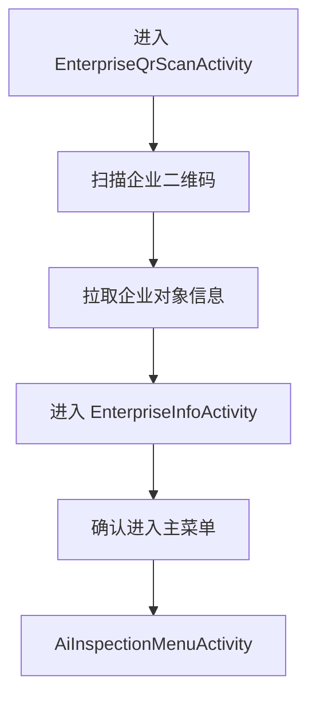

# 任务关联旅程图

```mermaid
flowchart TD
    A["进入 EnterpriseQrScanActivity"] --> B["扫描企业二维码"]
    B --> C["拉取企业对象信息"]
    C --> D["进入 EnterpriseInfoActivity"]
    D --> E["确认进入主菜单"]
    E --> F["AiInspectionMenuActivity"]
```

对应功能正文见 [功能模块/任务关联.md](C:\Users\wuchaoli\Desktop\codespace\glassdemo\docs\功能模块\任务关联.md)。
