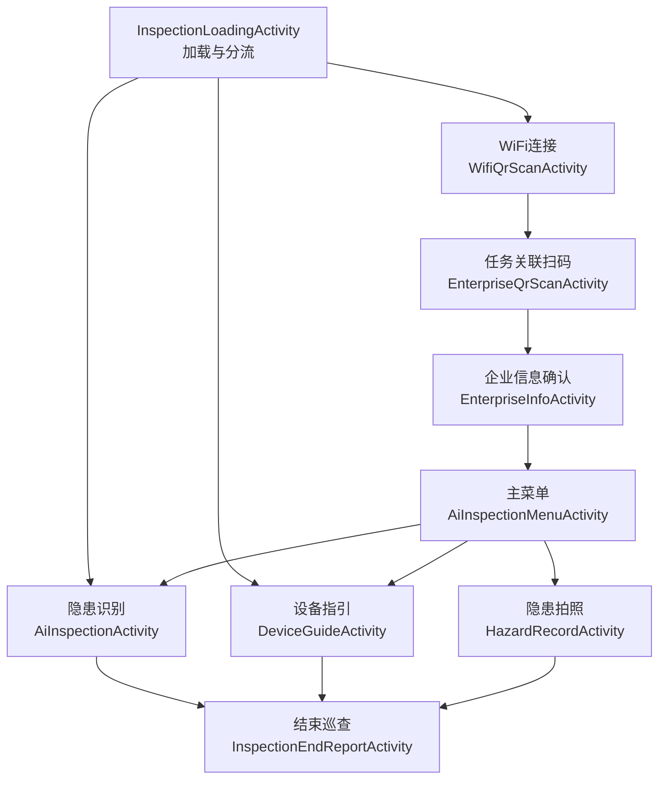

# 正式主链总体旅程图

关联总架构：[architecture.md](../architecture.md)

本文档描述当前正式巡检主链的全局用户旅程，重点回答“从哪里进、如何分流、如何跨功能、最终如何结束”，并明确哪些页面只是附录或调试入口。

## 主链概览

## 正式主链阶段

### 1. 加载与分流

- 应用桌面入口是 `InspectionLoadingActivity`
- 页面负责权限检查、SDK 初始化、相机预热、开始巡检会话
- 若企业巡检开关开启，则按 Wi-Fi 连接状态分流到 WiFi 连接或企业扫码
- 若企业巡检开关关闭，则进入默认首页或显式指定首页
- 当前支持通过 `EXTRA_NEXT_HOME_ACTIVITY` 在初始化完成后直接进入 `DeviceGuideActivity`

### 2. 网络与任务准备

- `WifiQrScanActivity` 负责配网和连通性验证
- `EnterpriseQrScanActivity` 负责解析企业二维码并拉取对象信息
- `EnterpriseInfoActivity` 负责展示企业对象信息，并确认是否进入功能菜单

### 3. 功能选择与功能执行

- `AiInspectionMenuActivity` 是正式功能分发页
- 当前正式能力包括：隐患识别、设备指引、隐患拍照
- 功能页之间允许通过语音跳转进入同级首页，但不恢复来源页中间态
- `AiInspectionActivity` 和 `DeviceGuideActivity` 的稳定直进受 `InspectionSession.isInitialized` 约束

### 4. 结束巡查

- `InspectionEndReportActivity` 是三条正式能力共用的结束页
- 取消时返回来源首页
- 确认时提交结束巡检上报并退出任务

## 会话依赖

- `InspectionSession`
  - 决定识别页和设备指引页能否直接进入
- `InspectionWorkflowSession`
  - 承接 Wi-Fi 模式、企业扫码信息、分析结果、结束页汇总数据

## 关键路由规则

| 来源页面 | 条件 / 动作 | 目标页面 | 备注 |
| --- | --- | --- | --- |
| `InspectionLoadingActivity` | 企业巡检关闭 | `AiInspectionActivity` 或显式指定首页 | 默认首页是隐患识别 |
| `InspectionLoadingActivity` | 企业巡检开启且已联网 | `EnterpriseQrScanActivity` | 直接进入任务关联 |
| `InspectionLoadingActivity` | 企业巡检开启且未联网 | `WifiQrScanActivity` | 先做配网 |
| `EnterpriseInfoActivity` | `Confirm` | `AiInspectionMenuActivity` | 进入功能分发页 |
| `AiInspectionMenuActivity` | 菜单确认 | 三个正式功能首页之一 | 只进入目标首页 |
| `AiInspectionActivity` / `DeviceGuideActivity` / `HazardRecordActivity` | 结束任务 | `InspectionEndReportActivity` | 共用结束页 |
| `InspectionEndReportActivity` | `Cancel` | 返回来源首页 | 通过 `InspectionEndReportReturnDestination` 区分 |
| `InspectionEndReportActivity` | `Confirm` | 退出任务 | 后台提交结束上报 |

## 附录页边界

以下页面当前不属于正式主链真相源，只作为调试或附录页保留：

- `UnifiedInputDebugActivity`
- `HiddenRiskProbeActivity`
- `LightshotActivity`
- `HomeActivity`
- `InspectionModeActivity`
