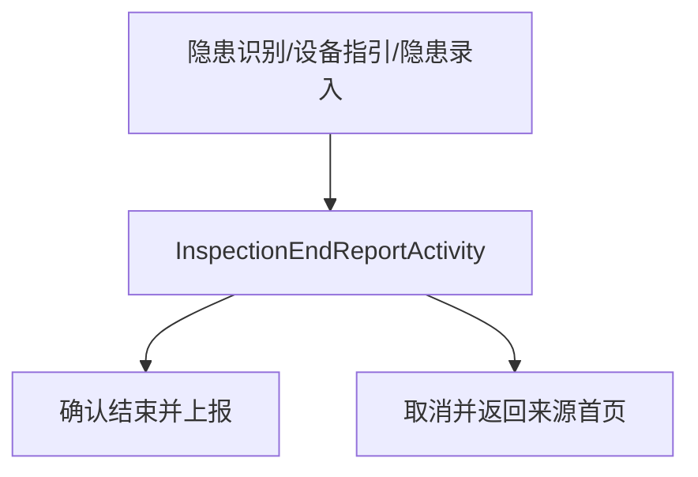

# 结束巡查旅程图

```mermaid
flowchart TD
    A["隐患识别/设备指引/隐患录入"] --> B["InspectionEndReportActivity"]
    B --> C["确认结束并上报"]
    B --> D["取消并返回来源首页"]
```

对应功能正文见 [功能模块/结束巡查.md](C:\Users\wuchaoli\Desktop\codespace\glassdemo\docs\功能模块\结束巡查.md)。
