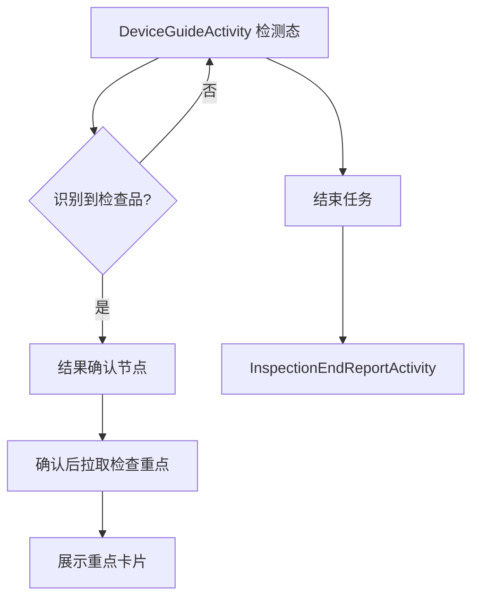

# 设备指引旅程图

```mermaid
flowchart TD
    A["DeviceGuideActivity 检测态"] --> B{"识别到检查品?"}
    B -- 否 --> A
    B -- 是 --> C["结果确认节点"]
    C --> D["确认后拉取检查重点"]
    D --> E["展示重点卡片"]
    A --> F["结束任务"]
    F --> G["InspectionEndReportActivity"]
```

对应功能正文见 [设备指引/用户旅程.md](C:\Users\wuchaoli\Desktop\codespace\glassdemo\docs\设备指引\用户旅程.md)。
