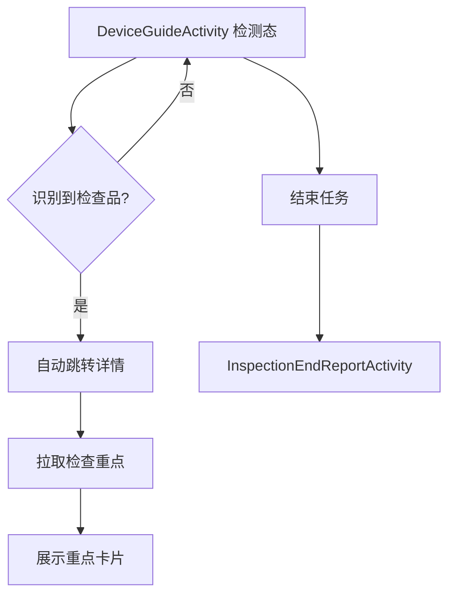

# 设备指引旅程图

关联总架构：[architecture.md](../architecture.md)

关联模块：[功能模块/设备指引.md](../功能模块/设备指引.md)

```mermaid
flowchart TD
    A["DeviceGuideActivity 检测态"] --> B{"识别到检查品?"}
    B -- 否 --> A
    B -- 是 --> C["自动跳转详情"]
    C --> D["拉取检查重点"]
    D --> E["展示重点卡片"]
    A --> F["结束任务"]
    F --> G["InspectionEndReportActivity"]
```

对应功能正文见 [功能模块/设备指引.md](C:\Users\wuchaoli\Desktop\codespace\glassdemo\docs\功能模块\设备指引.md)。
