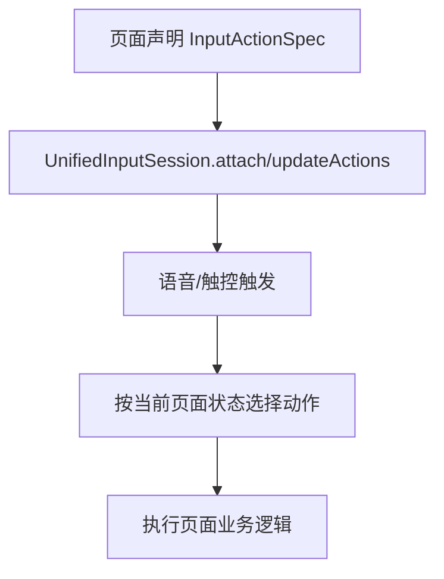

# 输入旅程图

```mermaid
flowchart TD
    A["页面声明 InputActionSpec"] --> B["UnifiedInputSession.attach/updateActions"]
    B --> C["语音/触控触发"]
    C --> D["按当前页面状态选择动作"]
    D --> E["执行页面业务逻辑"]
```

对应功能正文见 [输入/用户旅程.md](C:\Users\wuchaoli\Desktop\codespace\glassdemo\docs\输入\用户旅程.md)。
