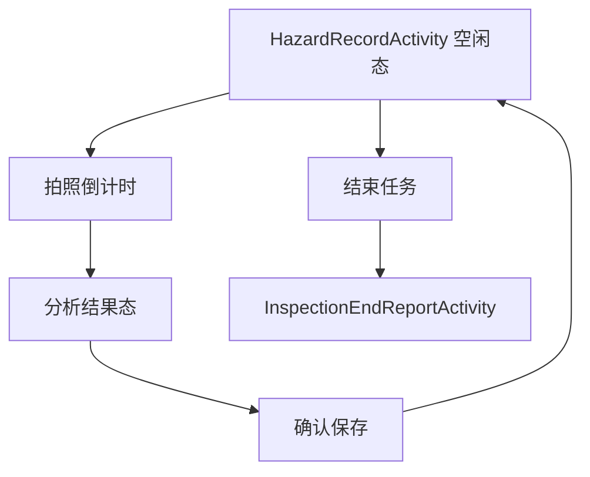

# 隐患录入旅程图

关联总架构：[architecture.md](../architecture.md)

关联模块：[功能模块/隐患录入.md](../功能模块/隐患录入.md)

```mermaid
flowchart TD
    A["HazardRecordActivity 空闲态"] --> B["拍照倒计时"]
    B --> C["分析结果态"]
    C --> D["确认保存"]
    D --> A
    A --> E["结束任务"]
    E --> F["InspectionEndReportActivity"]
```

对应功能正文见 [功能模块/隐患录入.md](C:\Users\wuchaoli\Desktop\codespace\glassdemo\docs\功能模块\隐患录入.md)。
