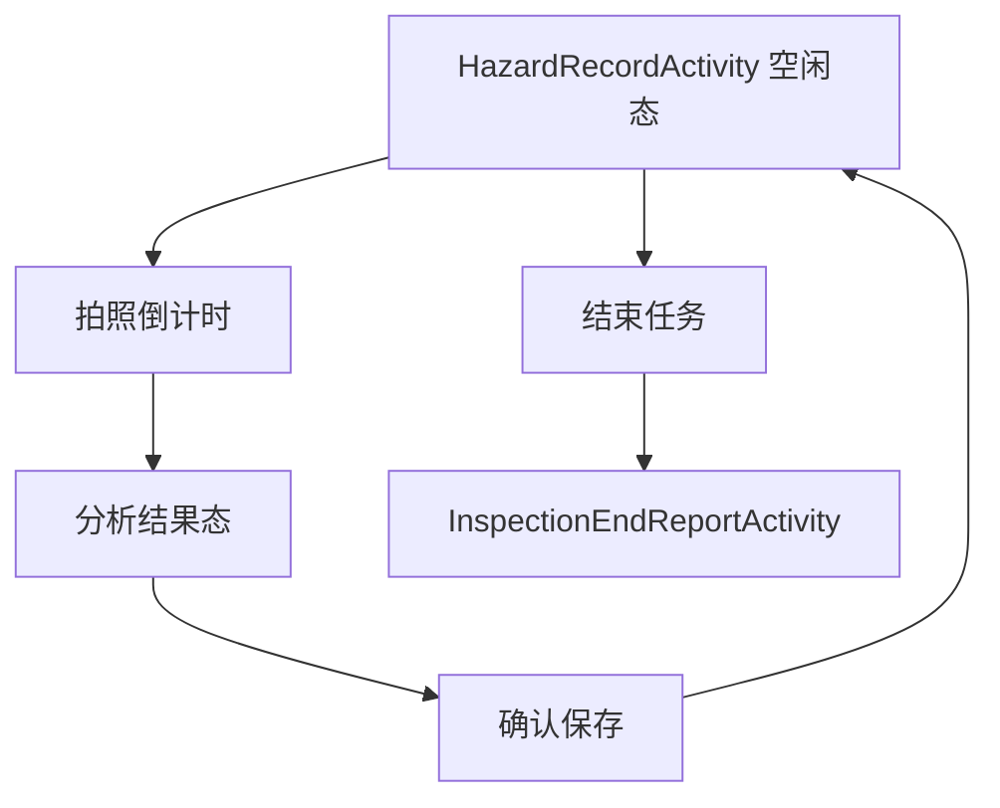

# 隐患录入旅程图

```mermaid
flowchart TD
    A["HazardRecordActivity 空闲态"] --> B["拍照倒计时"]
    B --> C["分析结果态"]
    C --> D["确认保存"]
    D --> A
    A --> E["结束任务"]
    E --> F["InspectionEndReportActivity"]
```

对应功能正文见 [隐患录入/用户旅程.md](C:\Users\wuchaoli\Desktop\codespace\glassdemo\docs\隐患录入\用户旅程.md)。
