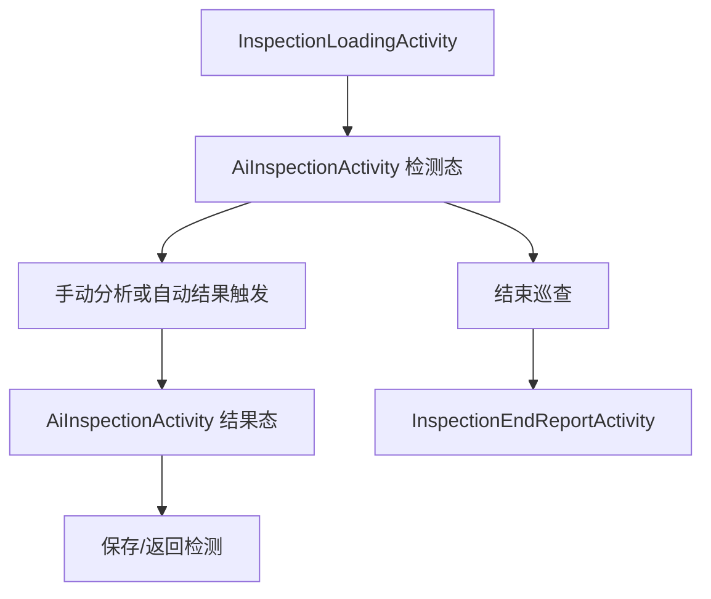

# 隐患识别旅程图

关联总架构：[architecture.md](../architecture.md)

关联模块：[功能模块/隐患识别.md](../功能模块/隐患识别.md)

```mermaid
flowchart TD
    A["InspectionLoadingActivity"] --> B["AiInspectionActivity 检测态"]
    B --> C["手动分析或自动结果触发"]
    C --> D["AiInspectionActivity 结果态"]
    D --> E["保存/返回检测"]
    B --> F["结束巡查"]
    F --> G["InspectionEndReportActivity"]
```

对应功能正文见 [功能模块/隐患识别.md](C:\Users\wuchaoli\Desktop\codespace\glassdemo\docs\功能模块\隐患识别.md)。
